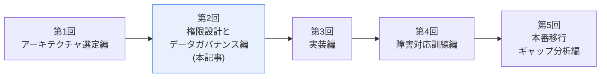
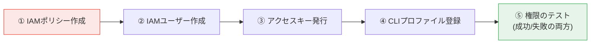
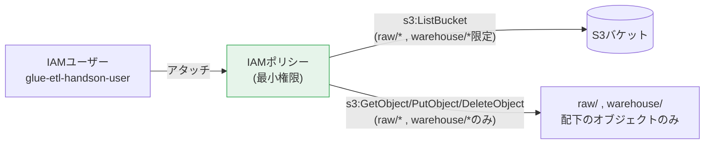
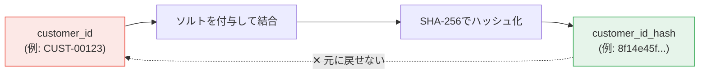
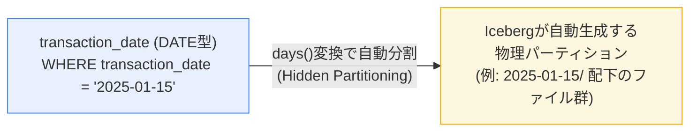

## 前回までのおさらい

[第1回](#)では、Iceberg / Hadoopカタログを選んだ理由の整理と、検証用S3バケット(以下、本記事では例として`glue-etl-handson-abcd1234`という名前を使います。**ご自身が生成した値に読み替えてください**)の作成までを行いました。



今回は、**「日常のETL処理を実行する専用のIAMユーザー」**を、最小権限の考え方に基づいて作成します。あわせて、`customer_id`のマスキング設計と、Icebergのパーティション設計についても扱います。本記事内の画像も、第1回同様、実際にこのハンズオンを一度通しで実行した際の実機キャプチャです。

前回同様、環境の払い出し作業(IAMポリシー・ユーザー作成)は管理者プロファイル`default`で行い、**日常のETL処理には一切`default`を使いません。**

> ✅ **この記事(第2回)を読み終えると、こうなります**
> - `s3:ListBucket`と`s3:GetObject`/`s3:PutObject`でARNの粒度が異なる理由を理解し、**自分でも同種のIAMポリシーを設計できる**
> - 「権限が絞られていること」を、**失敗するはずのテストを自分で組み立てて検証できる**
> - `customer_id`のようなPIIをマスキングする際、**ハッシュ化と決定的暗号化のどちらを選ぶべきかを、法的な位置づけも含めて判断できる**
>
> **前提知識**: 第1回の内容(S3バケットの作成・IAMプロファイルの分離)を終えていること。

## この回で目指すゴール



①〜④はすべて管理者プロファイル`default`で行う払い出し作業、⑤だけは新しく作った`glue-etl-handson`プロファイルで行う検証作業です。

## IAM最小権限ポリシーの設計

### 何にアクセスさせるべきかを整理する

最小権限の設計で最初にやるべきは、「機能から考える」のではなく**「この処理は何をするために、どのリソースに、どの操作をする必要があるか」を先に洗い出す**ことです。今回のETL処理を分解すると、以下の操作だけで完結します。

| 処理内容 | 必要な操作 | 対象 |
|---|---|---|
| ダミーCSVの存在確認・一覧取得 | `s3:ListBucket` | バケット全体(ただし`raw/`配下に限定したい) |
| CSVの読み込み | `s3:GetObject` | `raw/*` |
| Icebergテーブルの書き出し・更新 | `s3:PutObject` | `warehouse/*` |
| Icebergのメタデータ読み込み(テーブルを開く際) | `s3:GetObject` | `warehouse/*` |
| コンパクション・スナップショット削除等の保守操作 | `s3:DeleteObject` | `warehouse/*` |

ここで意識すべき重要なポイントが2つあります。

**① `s3:ListBucket`と`s3:GetObject`/`s3:PutObject`は、ARNの粒度が異なる**

`s3:ListBucket`は「バケットの中身を一覧する」操作なので、Resourceには**バケットそのもののARN**(`arn:aws:s3:::バケット名`)を指定します。一方`s3:GetObject`/`s3:PutObject`は「個々のオブジェクトを操作する」ので、Resourceには**オブジェクトのARN**(`arn:aws:s3:::バケット名/プレフィックス/*`)を指定する必要があります。ここを混同して同じResourceを両方の操作に指定してしまうミスは、実務でも頻発します。

**② `s3:ListBucket`はバケット全体に対する操作だが、`Condition`で見える範囲を絞れる**

このETLユーザーには`raw/`と`warehouse/`以外のプレフィックスが将来バケット内に増えても、それらは一覧に出す必要がありません。`s3:prefix`条件を使うことで、「一覧できる範囲」自体をプレフィックス単位に絞り込めます。

### ポリシーJSON

以上を踏まえたポリシーが以下です。

```json
{
  "Version": "2012-10-17",
  "Statement": [
    {
      "Sid": "AllowListBucketLimitedToRawAndWarehouse",
      "Effect": "Allow",
      "Action": "s3:ListBucket",
      "Resource": "arn:aws:s3:::glue-etl-handson-abcd1234",
      "Condition": {
        "StringLike": {
          "s3:prefix": ["raw/*", "warehouse/*"]
        }
      }
    },
    {
      "Sid": "AllowReadWriteObjectsInRawAndWarehouse",
      "Effect": "Allow",
      "Action": [
        "s3:GetObject",
        "s3:PutObject",
        "s3:DeleteObject"
      ],
      "Resource": [
        "arn:aws:s3:::glue-etl-handson-abcd1234/raw/*",
        "arn:aws:s3:::glue-etl-handson-abcd1234/warehouse/*"
      ]
    }
  ]
}
```

> ⚠️ **`s3:DeleteObject`を含めることについて**
> Icebergは古いスナップショットやメタデータファイルの整理(`expire_snapshots`や`rewrite_data_files`後の不要ファイル削除)のために`DeleteObject`権限を必要とします。ただし「削除できる」権限は事故のリスクでもあります。第1回でバケットのバージョニングを有効化したのは、まさにこの`DeleteObject`権限を持つユーザーが誤って削除しても、**バージョニングにより実体は残り復旧できる**ようにするためです。「削除権限を絞る」だけでなく「削除されても戻せる仕組みとセットで設計する」のが実務的な考え方です。

このポリシーには、バケットの削除・ポリシー変更・他バケットへのアクセスなど、**ETL処理に不要な操作は一切含まれていません。** これが最小権限の考え方です。



> 📎 **FISC安全対策基準との対応**:このポリシー設計は、第1回で整理した「実務基準(アクセス管理)」に相当します。「必要最小限の権限のみを付与する」という考え方自体が、FISC安全対策基準に限らずISMSやNISTなど主要なセキュリティ基準に共通する原則です。

## ハンズオン Step 2: IAMポリシーの作成

作業はすべて`default`プロファイルで行います。

### 2-1. ポリシーファイルを作成する

PowerShellでJSONファイルを作成します。**`glue-etl-handson-abcd1234`の部分は、第1回でご自身が生成したバケット名に置き換えてください。**

```powershell
@'
{
  "Version": "2012-10-17",
  "Statement": [
    {
      "Sid": "AllowListBucketLimitedToRawAndWarehouse",
      "Effect": "Allow",
      "Action": "s3:ListBucket",
      "Resource": "arn:aws:s3:::glue-etl-handson-abcd1234",
      "Condition": {
        "StringLike": {
          "s3:prefix": ["raw/*", "warehouse/*"]
        }
      }
    },
    {
      "Sid": "AllowReadWriteObjectsInRawAndWarehouse",
      "Effect": "Allow",
      "Action": [
        "s3:GetObject",
        "s3:PutObject",
        "s3:DeleteObject"
      ],
      "Resource": [
        "arn:aws:s3:::glue-etl-handson-abcd1234/raw/*",
        "arn:aws:s3:::glue-etl-handson-abcd1234/warehouse/*"
      ]
    }
  ]
}
'@ | Out-File -FilePath ./glue-etl-handson-policy.json -Encoding utf8
```

### 2-2. IAMポリシーを作成する

```powershell
aws iam create-policy `
  --policy-name glue-etl-handson-policy `
  --policy-document file://glue-etl-handson-policy.json `
  --profile default
```

実行結果に含まれる`Arn`(例: `arn:aws:iam::123456789012:policy/glue-etl-handson-policy`)を**メモしてください**。次のステップでこのARNを使います。


```powershell
# 変数に控えておくと以降のコマンドが楽になります
$policyArn = "ここに表示されたArnを貼り付け"
```

> 📸 **証跡として残すもの**: `create-policy`の実行結果(特に`Arn`と`CreateDate`)をスクリーンショットで保存してください。「いつ、どのようなポリシーが作成されたか」の記録になります。

## ハンズオン Step 3: IAMユーザーの作成

### 3-1. IAMユーザーを作成する

```powershell
aws iam create-user `
  --user-name glue-etl-handson-user `
  --tags Key=Project,Value=glue-etl-handson `
  --profile default
```

### 3-2. ポリシーをアタッチする

```powershell
aws iam attach-user-policy `
  --user-name glue-etl-handson-user `
  --policy-arn $policyArn `
  --profile default
```

### 3-3. アタッチ状況を確認する

```powershell
aws iam list-attached-user-policies `
  --user-name glue-etl-handson-user `
  --profile default
```

`glue-etl-handson-policy`が1件だけ表示されることを確認してください。**複数のポリシーがアタッチされている場合、意図しない権限が混入している可能性があるため要注意です。**


> 📸 **証跡として残すもの**: `create-user`と`list-attached-user-policies`の実行結果を保存してください。

## ハンズオン Step 4: アクセスキーの発行

### 4-1. アクセスキーを発行する

```powershell
aws iam create-access-key `
  --user-name glue-etl-handson-user `
  --profile default
```

実行結果には`AccessKeyId`と`SecretAccessKey`が表示されます。

> 🔴 **重要: このステップだけは、スクリーンショットをそのまま証跡にしてはいけません。**
> `SecretAccessKey`はこの発行時にしか表示されない、極めて機密性の高い情報です。実務では「シークレットキーの値そのものが写った画面」を証跡として保管することは**それ自体が情報漏えいリスク**になります。証跡として残すべきは「いつ・どのユーザーに対してアクセスキーが発行されたか」という**事実(AccessKeyIdと発行日時)**であり、**SecretAccessKeyの値を画面ごとマスキングしてから保存する**、あるいは`AccessKeyId`のみをテキストで記録する、という運用にしてください。
>
> このように**「証跡を残すこと」と「機密情報を保護すること」がぶつかる場面がある**、という気づき自体が、本ハンズオンの重要なポイントです。
>
> ⚠️ **なお、`SecretAccessKey`は発行時にしか表示されません。** 控え忘れた場合、後から再表示することはできず、対処法はアクセスキーを削除して再発行する以外にありません。書き留める前に画面を閉じないよう注意してください。

表示された`AccessKeyId`と`SecretAccessKey`は、次のステップですぐに使うので、安全な場所(パスワードマネージャー等)に一時的に控えておいてください。

## ハンズオン Step 5: CLIプロファイルの登録

いよいよ、日常のETL処理専用のプロファイルを、ご自身のPCに登録します。**既存の`default`プロファイルには一切触れません。**

```powershell
aws configure --profile glue-etl-handson
```

対話式で以下を入力します。

```
AWS Access Key ID [None]: (先ほど控えたAccessKeyIdを入力)
AWS Secret Access Key [None]: (先ほど控えたSecretAccessKeyを入力)
Default region name [None]: ap-northeast-1
Default output format [None]: json
```


## ハンズオン Step 6: 権限が正しく絞られていることのテスト

**ここが今回の最重要ポイントです。** 「意図した操作ができること」だけでなく、**「意図していない操作が、きちんと拒否されること」まで確認して初めて、最小権限設計が検証できたと言えます。**

### 6-1. 身元の確認(成功するはず)

```powershell
aws sts get-caller-identity --profile glue-etl-handson
```

`Arn`が`arn:aws:iam::(アカウントID):user/glue-etl-handson-user`になっていることを確認してください。

### 6-2. 許可されている操作の確認(成功するはず)

```powershell
aws s3 ls "s3://glue-etl-handson-abcd1234/raw/" --profile glue-etl-handson
aws s3 ls "s3://glue-etl-handson-abcd1234/warehouse/" --profile glue-etl-handson
```

前回作成した`raw/`と`warehouse/`が問題なく参照できるはずです。


### 6-3. 許可されていない操作の確認(失敗するはずのテスト)

以下は**すべて失敗(Access Denied)することが正しい状態**です。もし成功してしまった場合、ポリシー設計を見直す必要があります。

```powershell
# ① バケット一覧の取得(このユーザーにはs3:ListAllMyBucketsを与えていないため失敗するはず)
aws s3 ls --profile glue-etl-handson

# ② raw/ , warehouse/ 以外のプレフィックスへの書き込み(想定外のプレフィックスへの書き込みを試す)
"test" | Out-File -FilePath ./test.txt -Encoding utf8
aws s3 cp ./test.txt "s3://glue-etl-handson-abcd1234/tmp/test.txt" --profile glue-etl-handson

# ③ バケットポリシーの変更(管理者操作の権限がないことを確認する)
aws s3api get-bucket-policy --bucket glue-etl-handson-abcd1234 --profile glue-etl-handson
```

**①〜③がすべて`AccessDenied`または`An error occurred`で終わっていれば、最小権限ポリシーが意図通りに機能しているという証拠になります。**


> 📸 **証跡として残すもの**: Step 6-1〜6-3すべての実行結果(成功したものも、Access Deniedになったものも両方)を保存してください。**「失敗することを確認した」というエビデンスは、成功した証跡と同じくらい、あるいはそれ以上に監査上の価値があります。** 実務でも「境界値のテストをやったかどうか」が権限設計レビューで問われるポイントです。

## `customer_id`のマスキング設計

### なぜマスキングが必要か

取引明細データには`customer_id`のような、直接個人を特定できる情報が含まれます。検証環境とはいえ、S3に平文で置くこと自体がリスクです(今回はダミーデータですが、本番データを扱う想定で設計します)。

### 方式の選択:一方向ハッシュ vs 決定的暗号化

マスキングには大きく2つの方式があり、**どちらを選ぶかは「マスキング後のデータを何に使うか」で決まります。**

| 観点 | 一方向ハッシュ(例: SHA-256) | 決定的暗号化(Deterministic Encryption) |
|---|---|---|
| 可逆性 | 不可逆(元の`customer_id`には戻せない) | 可逆(正しい鍵があれば復号できる) |
| 同じ入力→同じ出力になるか | なる(名寄せ・突合には使える) | なる(同上) |
| 主な用途 | 統計・分析用途、他システムとの照合が不要な場合 | 権限を持つ担当者が後から本人特定に戻す必要がある場合(問い合わせ対応、コンプライアンス調査等) |
| 鍵管理の要否 | ソルト(pepper)の管理は必要だが、鍵の保管・ローテーションの負荷は比較的軽い | 暗号鍵の保管・アクセス制御・ローテーションが必須。本番では**AWS KMS**等の鍵管理サービスとセットで運用する必要がある |

**今回のハンズオンでは、一方向ハッシュ(SHA-256 + ソルト)を採用します。** 理由は、この検証の目的が「分析用データとしてマスキングされたテーブルを作る」ことであり、元の`customer_id`に戻す必要がある業務要件が(今回は)ないためです。



> ⚠️ **ソルト(pepper)の扱いについて**
> ハッシュ化は「同じ入力なら常に同じ出力になる」ため、ソルトを固定せずに使うと、攻撃者が想定される`customer_id`のパターンを総当たりでハッシュ化して照合する(レインボーテーブル攻撃的な手法)リスクが残ります。**ソルトの値をPySparkスクリプトに直接ハードコードすることは絶対に避けてください。** 本番であればAWS Secrets ManagerやSSM Parameter Store(SecureString)からソルトを取得するのが基本です。今回の検証では、この点を擬似的に再現するため、第3回の実装編でソルトを**環境変数から読み込む**形にし、「本番ではSecrets Manager化する」という設計上のTODOとして明記します。

**決定的暗号化について**: 今回は採用しませんが、「もし本人確認のため復号が必要な業務要件があった場合はどうするか」という考え方だけ触れておきます。その場合はAWS KMSのデータキー(Envelope Encryption)を使い、暗号鍵自体へのアクセス権限を復号が許可された担当者・システムだけに絞る、という設計になります。これは相応の運用コストがかかるため、「本当に復号可能性が必要か」を業務要件レベルで精査してから採用すべき、というのが実務的な判断です。

### 補足:個人情報保護法における位置づけとの関係

日本の個人情報保護法には、加工したデータの扱いを区別する2つの制度があります。整理すると次のようになります。

| 制度 | 可逆性 | 法的な扱い |
|---|---|---|
| **仮名加工情報** | 他の情報と照合すれば元に戻せる(可逆) | 加工後も「個人情報」として扱われ、第三者提供には原則本人同意が必要 |
| **匿名加工情報** | 個人情報を復元できない(非可逆)、識別子の連結符号なども削除 | 一定の要件を満たせば、本人同意なしに第三者提供が可能 |

> ⚠️ **注意**: このハンズオンで実装するSHA-256ハッシュ化は、`customer_id`の取り得る値のパターンが限られている場合、**ソルトと合わせて総当たりすれば元の値を推測できてしまう可能性があり**、法律上の「匿名加工情報」の要件(復元不可能であること)を自動的に満たすわけではありません。むしろ、「他の情報と照合すれば元に戻る可能性がある」という前提に立ち、**法的には仮名加工情報に近いもの、あるいは依然として個人情報そのものとして扱う**、という慎重な整理をしておくべきです。「ハッシュ化したから安全」という短絡的な判断は避け、実際の要件定義では法務・コンプライアンス部門と連携して、どちらの制度に該当するのか(あるいはどちらにも該当せず個人情報のままなのか)を確認する必要があります。この記事はその判断を代替するものではありません。

## Icebergのパーティション設計

### 採用する設計

`transaction_date`カラムに対して`days`変換を適用する、**Hidden Partitioning**を採用します。

```sql
CREATE TABLE local.db.transactions (
    transaction_id      STRING,
    transaction_date    DATE,
    customer_id_hash    STRING,
    amount              DECIMAL(15,2),
    branch_code         STRING,
    transaction_type    STRING,
    created_at          TIMESTAMP
)
USING iceberg
PARTITIONED BY (days(transaction_date))
TBLPROPERTIES (
    'format-version' = '2'
)
```

### なぜこの設計か



利用者が意識するのは`transaction_date`という論理カラムだけで、日付ごとの物理ファイル配置はIcebergが自動的に管理します。

- 銀行の取引明細は「特定日の取引を確認・監査する」というクエリが典型的で、`days`単位の粒度が業務パターンと合致します。
- Hiveスタイルのパーティションでは`transaction_date_str`のような専用カラムを別途作る必要がありますが、Icebergの**Hidden Partitioning**では`transaction_date`(DATE型)そのものにクエリすればよく、利用者はパーティション変換を意識する必要がありません。
- 数十行のダミーデータではパーティションプルーニングの効果は体感しづらいですが、「実務ではこの規模になったときにこう効いてくる」という説明とセットで扱います。

### パーティション進化(Partition Evolution)

Icebergのもう一つの強みが、**テーブルを再作成せずにパーティション構成を変更できる**ことです。

```sql
-- 既存データはそのまま、新しく書き込まれるデータから新パーティション構成が適用される
ALTER TABLE local.db.transactions
REPLACE PARTITION FIELD days(transaction_date) WITH months(transaction_date)
```

Hiveテーブルであればテーブルの作り直し(≒既存データの再配置)が必要になる操作ですが、Icebergでは**稼働を止めずに**設計変更ができます。「テーブルを止められない」ミッションクリティカルな環境では、この特性自体が採用理由になり得ます。

> 📎 **FISC安全対策基準との対応**:この回で扱った内容は、第1回の対応表で示した「実務基準(アクセス管理)」に加えて、マスキング設計は「実務基準(情報の保護)」にも対応します。個人情報を扱うシステムでは、権限設計とデータの保護(マスキング・暗号化)を両輪で設計する必要があり、今回はその両方を扱いました。

## この回のまとめ

- IAMポリシーを**「何にアクセスさせるべきか」から逆算して設計**し、リソースの粒度(バケットARN vs オブジェクトARN)を意識して書いた
- 「権限が絞られていること」を、**失敗するはずのテストを実際に実行して確認**した(これが本記事のもっとも重要なポイントです)
- アクセスキー発行時の**証跡取得における機密情報の扱い**について明記した
- `customer_id`のマスキングを、**可逆性という観点からハッシュ化 vs 決定的暗号化を比較したうえで**選定し、**個人情報保護法の仮名加工情報/匿名加工情報という法的な枠組みとの関係も整理**した
- Icebergのパーティション設計を、**Hidden Partitioning・パーティション進化という機能的な強みとセットで**整理した

## 次回予告

第3回では、いよいよPySparkスクリプトの実装に入ります。今回設計したマスキング処理・パーティション設計を実際にコードに落とし込み、`glue-etl-handson`プロファイルを使って`docker run`でLXC上のコンテナから実行・検証します。
