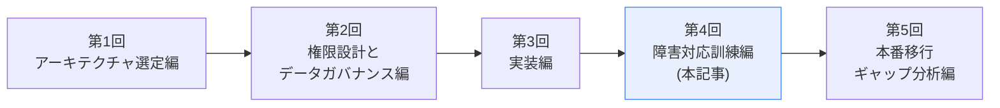
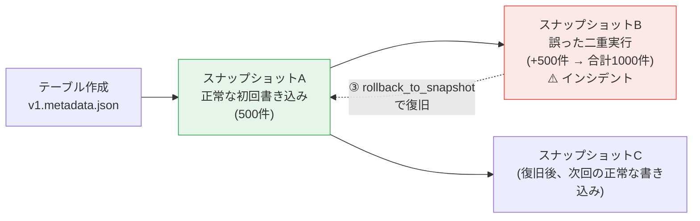
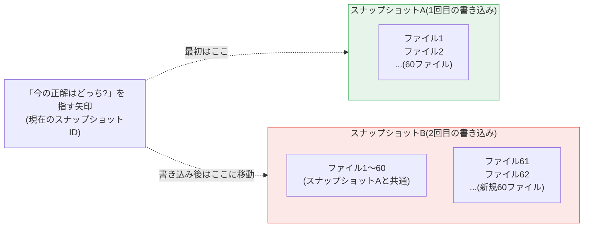

## 前回までのおさらい



第3回で、500件のダミー取引データをマスキングしたうえでIcebergテーブルに書き込みました。今回は、そのテーブルに対して**わざと事故を起こし、タイムトラベル機能で復旧する**という、実務でありがちなシナリオを再現します。

> ✅ **この記事(第4回)を読み終えると、こうなります**
> - Icebergの`system.rollback_to_snapshot`プロシージャで、**テーブルを過去の状態に戻せる**
> - 「異常に気づく」「復旧方針を承認する」「復旧後に検証する」という、**技術操作だけで終わらない障害対応の一連の流れ**を体験できる
> - Icebergのスナップショット履歴が、**単なる復旧機能ではなく監査証跡としても機能する**ことを理解できる
>
> **前提知識**: 第3回のハンズオンを完了し、`local.db.transactions`テーブルに500件のデータが書き込まれていること。

## 想定する事故シナリオ

**「日次バッチの再実行を誤って重複させてしまい、全期間のデータが2倍になった」** という事故を想定します。これは、スケジューラの設定ミス、手動再実行の連絡漏れ、リトライ処理の誤作動などで、実務でも実際に起こり得るシナリオです。



この後の流れは、**①ベースラインの記録 → ②事故の再現 → ③検知 → ④復旧の承認 → ⑤タイムトラベルによる復旧 → ⑥復旧後の検証**、の6ステップです。

## そもそも「タイムトラベル」とは何か

ここまで「タイムトラベル」という言葉を何度も使ってきましたが、一度も仕組みを説明していませんでした。手を動かす前に、ここで整理します。

### 一般的なデータベースとの違い

普通のデータベースやファイルは、データを上書き・削除すると**元の状態は残りません。** 「昨日の状態に戻したい」と思っても、別途取ってあったバックアップを、時間をかけて丸ごとリストアするしかないのが一般的です。

Icebergは違います。**データを一度も上書きしません。** 書き込みのたびに、常に**新しいファイルを追加**し、「今どのファイルの組み合わせが最新のテーブルなのか」を示す**目次のようなもの(スナップショット)**を新しく作ります。



第3回・今回のハンズオンで見た`v1.metadata.json`、`v2.metadata.json`、`v3.metadata.json`は、まさにこの「目次」の実体です。バージョンが増えるたびに、新しい目次が追加されているだけで、**古い目次(そして、それが指しているファイル)は消えずに残っています。**

### なぜ「一瞬で」復旧できるのか

`rollback_to_snapshot`が実行しているのは、**「今の正解はどっち?」を指す矢印(現在のスナップショットID)を、古い目次の方に向け直すだけ**です。データそのものをコピーしたり、書き戻したりする作業は一切発生しません。だからこそ、数百万件のテーブルであっても、コマンド一つ・数秒程度で「過去の状態」に戻せます。実際に先ほどのStep 5でも、`CALL local.system.rollback_to_snapshot(...)`は一瞬で完了したはずです。

### なぜ銀行のようなシステムでこれが「命綱」になるのか

- **誤操作・バグからの復旧が速い**: 夜間バッチにバグがあり、取引データを誤って重複・上書きしてしまっても、「バグが走る前の目次」を指定するだけで復旧できます。従来の「バックアップから何時間もかけて書き戻す」という方法と比べ、システムを止める時間を大幅に短縮できます(実際に今回のStep 2〜6は、数分で完結しました)。
- **過去の状態を、止めずに調査できる**: 「昨日の昼時点でこのテーブルはどうなっていたか」を、`VERSION AS OF`という構文で指定すれば、本番のテーブルに一切手を触れずに、過去の状態を読み取り専用で確認できます。ただし、これは覚えておいてほしいのですが、`rollback_to_snapshot`(メタデータの書き換えだけ)とは異なり、`VERSION AS OF`で実際にデータを読み取る操作は、**その時点のデータファイルを実際にS3から読み込む(=課金が発生する)操作です。** 「過去を覗ける」機能自体はタダではありません。この点はStep 6で実際に確認します。

### 先ほどのスクリプトとのつながり

第3回で書いた、このテーブル定義を思い出してください。

```sql
CREATE TABLE IF NOT EXISTS local.db.transactions (
    ...
)
USING iceberg
PARTITIONED BY (days(transaction_date))
TBLPROPERTIES ('format-version' = '2')
```

**`USING iceberg`と指定してテーブルを作った時点で、この「スナップショットが自動的に積み上がっていく仕組み」は標準機能として有効になっています。** 特別な設定を追加しなくても、書き込むたびに目次が増え、過去の状態がすべて参照可能な状態で残り続けます。これが、第1回で「Icebergを選んだ理由」として触れた「監査ログとしてのスナップショット」の正体です。

> ⚠️ **注意**: 過去のスナップショットは、無期限に残り続けるわけではありません。ストレージ容量を圧迫しないよう、実務では`expire_snapshots`というプロシージャで、一定期間より古いスナップショットを明示的に削除(期限切れに)する運用が必要です。今回のハンズオンではこの整理は行いませんが、本番運用では欠かせない考慮点です。

### 補足: 「7日間は遡れて、8日目以降は自動削除」という運用は実際に組める

金融機関のAWSチームでは、「何かあったときのために直近7日間はタイムトラベルで戻れるようにし、それより古いものは定期的に自動削除する」という**リテンションポリシー**を組んでいることがあります。これはIcebergの標準機能だけで実現できます。

**① 保持期間をテーブルのプロパティとして設定する**

```sql
ALTER TABLE local.db.transactions SET TBLPROPERTIES (
    'history.expire.max-snapshot-age-ms' = '604800000',
    'history.expire.min-snapshots-to-keep' = '1'
);
```

- `history.expire.max-snapshot-age-ms`:スナップショットを保持する最大期間(ミリ秒)。`604800000`は7日間です(デフォルトは432000000 = 5日間)
- `history.expire.min-snapshots-to-keep`:期間に関わらず、**最低限残しておくスナップショット数**(デフォルトは1)。この数だけは、たとえ7日を過ぎていても消えません

**② 実際に削除を実行する(これは自動では走りません)**

ここが誤解しやすいポイントですが、**①でプロパティを設定しただけでは、何も削除されません。** `expire_snapshots`プロシージャを実際に呼び出すという「実行」があって初めて、期限切れのスナップショットと、それに紐づく不要なデータファイルが整理されます。

```sql
CALL local.system.expire_snapshots('local.db.transactions')
```

このコマンドを、**EventBridge(スケジューラ)+ Glueジョブ、あるいはLambdaなどで毎日1回自動実行する**、という形にして初めて、「7日間は遡れて、8日目以降は自動で消える」という運用が完成します。Iceberg自体は「ゴミ掃除の設定」と「掃除機」は提供してくれますが、**「毎日スイッチを押す」部分は、利用者側で仕組みを作る必要がある**、ということです。この自動化の設計は、第5回(本番移行ギャップ分析編)で扱います。

以上を踏まえて、実際に手を動かしていきます。

## Step 1: ベースラインを記録する(事故の前に)

実際の障害対応では「正常な状態がどうだったか」を事前に記録していなければ、何が壊れたのかを判断できません。まず、現在(正常な状態)の集計値を記録しておきます。

LXCにSSHログインし、第3回のStep 3-2/3-3の要領で環境変数(`AWS_ACCESS_KEY_ID`、`AWS_SECRET_ACCESS_KEY`、`AWS_REGION`、`BUCKET_NAME`)を再設定したうえで、PySparkシェルを起動してください。

```bash
docker run --rm -it \
  --security-opt apparmor=unconfined \
  -e AWS_ACCESS_KEY_ID \
  -e AWS_SECRET_ACCESS_KEY \
  -e AWS_REGION \
  -e BUCKET_NAME \
  amazon/aws-glue-libs:5 \
  pyspark \
  --conf spark.sql.extensions=org.apache.iceberg.spark.extensions.IcebergSparkSessionExtensions \
  --conf spark.sql.catalog.local=org.apache.iceberg.spark.SparkCatalog \
  --conf spark.sql.catalog.local.type=hadoop \
  --conf spark.sql.catalog.local.warehouse=s3a://$BUCKET_NAME/warehouse
```


以下を実行し、**結果を必ずメモしてください**(この後の復旧確認で使います)。

```python
spark.sql("""
    SELECT COUNT(*) AS total_count,
           COUNT(DISTINCT customer_id_hash) AS unique_customers,
           SUM(amount) AS total_amount
    FROM local.db.transactions
""").show()
```


```python
spark.sql("SELECT snapshot_id, committed_at, operation FROM local.db.transactions.snapshots ORDER BY committed_at").show(truncate=False)
```


2つ目のクエリで表示される`snapshot_id`(第3回で確認した`298233760807595217`のはずです)も、**「正常な状態に対応するスナップショットID」として控えておいてください。**

> 📸 **証跡として残すもの**: 上記2つのクエリ結果(件数・顧客数・合計金額、およびスナップショットID)を保存してください。これが「事故前の正常な状態」の記録になります。

## Step 2: 事故を再現する(バッチの誤った二重実行)

Sparkシェルを`exit()`で抜け、**第3回のStep 3-4と全く同じ`docker run`コマンドを、もう一度実行します。**

```bash
docker run --rm -it \
  --security-opt apparmor=unconfined \
  -e AWS_ACCESS_KEY_ID \
  -e AWS_SECRET_ACCESS_KEY \
  -e AWS_REGION \
  -e BUCKET_NAME \
  -e MASKING_SALT \
  -v /home/etl-operator/etl:/home/glue_user/workspace \
  amazon/aws-glue-libs:5 \
  spark-submit /home/glue_user/workspace/transactions_etl.py
```

`transactions_etl.py`は`writeTo(...).append()`で書き込む実装だったため、同じCSVに対してもう一度実行すると、**同じ500件がそのまま追加され、テーブルの合計が1000件になってしまいます。** これが今回のシナリオでの「事故」です。実行ログのうち、確認すべき箇所を抜粋します。

```
26/09/06 04:07:37 INFO SparkWrite: Committing append with 60 new data files to table local.db.transactions
26/09/06 04:07:38 INFO HadoopTableOperations: Committed a new metadata file s3a://(バケット名)/warehouse/db/transactions/metadata/v3.metadata.json
26/09/06 04:07:38 INFO SnapshotProducer: Committed snapshot 4102074653689823777 (MergeAppend)
26/09/06 04:07:39 INFO LoggingMetricsReporter: Received metrics report: ... totalDataFiles=CounterResult{unit=COUNT, value=120} ... addedRecords=CounterResult{unit=COUNT, value=500} ... totalRecords=CounterResult{unit=COUNT, value=1000} ...
書き込み完了。件数: 500
```

新しいスナップショット`4102074653689823777`が作られ、`v3.metadata.json`が生成されています。`addedRecords=500`(今回追加された件数)に対して`totalRecords=1000`(テーブル全体の累計)となっており、**「同じ500件がもう一度丸ごと追加された」**ことがログの時点ですでに読み取れます。

> ⚠️ **最後の`書き込み完了。件数: 500`という出力に注意してください。** これはスクリプト自身の`print(masked_df.count())`が、**今回読み込んだCSVの件数(500)**を表示しているだけです。テーブル全体が1000件になったことには、スクリプト自身は気づいていません。**バッチのログが正常終了しているように見えても、テーブル全体としては異常が起きていることがある**、という実例です。

> 💡 実務であれば、これは「スケジューラの二重起動」「手動再実行の連絡漏れによる重複実行」などで発生します。今回はあえて何の防御機構(重複実行防止のロックや冪等性の担保)も入れずに実装しているため、素直に事故が再現されます。この「防御機構がないこと自体が本来は問題である」という点は、第5回の本番移行ギャップ分析で扱います。

## Step 3: 異常を検知する

再びPySparkシェルを起動し(Step 1と同じコマンド)、状態を確認します。

```python
spark.sql("""
    SELECT COUNT(*) AS total_count,
           COUNT(DISTINCT customer_id_hash) AS unique_customers,
           SUM(amount) AS total_amount
    FROM local.db.transactions
""").show()
```


`total_count`が`1000`になっており、Step 1で記録した`500`と一致しないはずです。**これが異常検知の第一歩です。** `unique_customers`は`50`のままで変わらず、`total_amount`はStep 1で記録した値のちょうど2倍になっているはずです(全件が単純に重複しているため)。

次に、**スナップショット履歴を「監査ログ」として使い**、何が起きたのかを調査します。

```python
spark.sql("""
    SELECT snapshot_id, committed_at, operation, summary['added-records'] AS added_records
    FROM local.db.transactions.snapshots
    ORDER BY committed_at
""").show(truncate=False)
```


結果には、Step 1で確認した最初のスナップショット(`added_records = 500`)に続いて、**もう1つ`added_records = 500`のスナップショットが、直近のタイムスタンプで記録されている**はずです。これが「誰が」を直接特定するものではありませんが、「いつ・何件のデータが追加する操作が行われたか」という事実は、Icebergのメタデータだけで機械的に追跡できます。

> 📎 **FISC安全対策基準との対応**:このスナップショット履歴の確認は、第1回で整理した「監査基準(証跡の確保)」に相当します。アプリケーションログを別途整備しなくても、**テーブル自体に変更履歴が残る**というのは、Icebergのような近代的なテーブルフォーマットならではの強みです。

> 📸 **証跡として残すもの**: 件数の異常(1000件)と、スナップショット履歴(2つの500件書き込みが記録されていること)の両方を保存してください。

## Step 4: 復旧方針の承認

**ここで技術的な復旧作業にすぐ入らないことが重要です。** 実務では、「どのスナップショットに、なぜ戻すのか」を明文化し、承認を得てから復旧作業に入るのが基本です。今回は一人で検証しているため実際の承認者はいませんが、**「承認を得るとしたら何を記録すべきか」を、実際にテンプレートとして書き出しておきます。**

| 項目 | 記入例 |
|---|---|
| 発生日時 | (Step 2を実行した日時) |
| 発生事象 | `local.db.transactions`テーブルへのバッチ処理が誤って二重実行され、全件が重複した(500件→1000件) |
| 検知者 | (自分の名前) |
| 検知方法 | 定期集計クエリでの件数不一致、およびスナップショット履歴の確認 |
| 影響範囲 | `local.db.transactions`テーブル全体(1000件中500件が重複データ) |
| 復旧方針 | スナップショットID `(Step 1で記録したID)` の状態にロールバックする |
| 承認者 | (実際の組織であれば、データオーナーやシステム責任者) |
| 承認日時 | (承認を得た日時) |
| 実施者 | (自分の名前) |

> ⚠️ **なぜこの手順を省略してはいけないのか**: タイムトラベルによる復旧は、コマンド一つで完了する手軽さがあります。しかし、その手軽さゆえに「気づいた人がその場の判断で勝手に戻す」という運用は、**「誰が・いつ・なぜ復旧を実施したか」が後から追えなくなるリスク**を伴います。第2回で扱った職務分掌(検知者と承認者を分ける)の考え方は、障害対応の場面でこそ重要になります。

## Step 5: タイムトラベルによる復旧を実行する

承認が得られた前提で、実際にロールバックします。前段で説明した通り、Icebergは`system.rollback_to_snapshot`というプロシージャを提供しており、「今の正解はどっち?」を指す矢印(現在のスナップショットID)を、指定したスナップショットの方に戻すことができます。

```python
spark.sql("""
    CALL local.system.rollback_to_snapshot('local.db.transactions', (Step 1で記録したスナップショットID))
""").show(truncate=False)
```


> 💡 **`rollback_to_snapshot`は、データファイルを削除するわけではありません。** テーブルの「現在のスナップショット」を指すポインタを、指定したスナップショットIDに戻すだけの、軽量なメタデータ操作です。**事故を起こした方のスナップショット(1000件になった状態)自体は、履歴から消えるわけではなく、`expire_snapshots`で明示的に期限切れにするまで残り続けます。** これは「なかったことにする」のではなく「正しい状態に戻しつつ、事故が起きたという事実は記録として保持し続ける」という、監査上望ましい振る舞いです。

## Step 6: 復旧後の検証

Step 1で記録した値と、今の状態を突き合わせます。

```python
spark.sql("""
    SELECT COUNT(*) AS total_count,
           COUNT(DISTINCT customer_id_hash) AS unique_customers,
           SUM(amount) AS total_amount
    FROM local.db.transactions
""").show()
```


- `total_count`が`500`に戻っていること
- `unique_customers`が`50`のままであること
- `total_amount`が、Step 1で記録した(事故前の)値と**完全に一致**していること

の3点をすべて確認してください。**特に金額の合計値が一致することの確認は、件数の一致だけでは見逃しかねない「同じ件数だが中身が入れ替わっている」という事故を防ぐために重要**です(今回のシナリオでは起こりませんが、実務ではこのクロスチェックが基本です)。

最後に、スナップショット履歴を再度確認します。

```python
spark.sql("""
    SELECT snapshot_id, committed_at, operation, summary['added-records'] AS added_records
    FROM local.db.transactions.snapshots
    ORDER BY committed_at
""").show(truncate=False)
```


事故を起こしたスナップショットの記録は消えておらず、**「一度事故が起きて、その後ロールバックで復旧した」という事実そのものが、履歴として残り続けている**ことを確認してください。

### 復旧できた=元通り、ではない: S3の実ファイルへの影響

**ここまでの確認は、すべて「Icebergのテーブルとして何が見えるか」という話でした。しかし、S3上に実際に置かれているファイルそのものは、ロールバックしても一切減っていません。** `rollback_to_snapshot`が変更したのは「どのファイル群を正解として参照するか」というメタデータ上の記述だけで、Step 2の事故で追加された60個のParquetファイルは、**今もS3に物理的に残ったままです。**

実際に確認してみます。**このコマンドはWindows PC側のPowerShellで実行します**(LXC自体にはAWS CLIが入っていないためです。第3回のStep 4-1と同じ理由です)。

```powershell
aws s3 ls "s3://$bucket/warehouse/db/transactions/data/" --recursive --summarize --profile glue-etl-handson | Select-Object -Last 5
```

`Total Objects`が、第3回終了時点の60個ではなく、**約120個(事故で追加された60個を含む)**になっているはずです。復旧が完了した今も、この増えた分のストレージ課金は発生し続けています。

> 💡 **これは冒頭で説明した「そもそもタイムトラベルとは何か」の裏返しです。** 「データを削除しない」からこそ一瞬で復旧できるわけですが、同じ理由で「不要になったファイルも自動では消えない」という副作用があります。この不要なファイルを整理するのが、すでに触れた`expire_snapshots`プロシージャの役割です。**「復旧できて終わり」ではなく、「不要になったスナップショットとファイルを、いつ・誰が・どう整理するか」まで含めて障害対応** —— この整理作業の自動化・運用ルール化は、第5回(本番移行ギャップ分析編)で扱う本番運用上の課題の1つです。

### 補足: 「参照されなくなった」だけで、消えたわけではないことを実際に確認する

ロールバックによって、通常のクエリ(`SELECT * FROM local.db.transactions`)が事故発生時のデータを返すことはもうありません。しかし、**事故発生時のスナップショットIDを明示的に指定すれば、今でもそのデータを読み出せます。**

```python
spark.sql("SELECT COUNT(*) FROM local.db.transactions VERSION AS OF 4102074653689823777").show()
```

```
+--------+
|count(1)|
+--------+
|    1000|
+--------+
```

事故発生時点の状態(重複した1000件)が、今でもそのまま読み取れることが確認できます。

> ⚠️ **これは「課金され続けている」ことの裏返しでもあります。** 誤って重複登録されたデータは、ロールバック後も参照可能な状態でS3に残り続けているということは、**その分のストレージ料金が発生し続けている**ということです。また、`VERSION AS OF`でこの過去データを実際に読み取る操作自体も、`rollback_to_snapshot`(メタデータの書き換えだけで完了する、ほぼ無料の操作)とは違い、**S3から実際にデータファイルを読み込むため、通常のクエリと同様に課金対象**になります。「一度誤って書き込んでしまったデータは、ロールバックだけでは完全にはなくならず、静かにコストを積み上げ続ける」という点は、実務で見落とされがちな観点です。ストレージ費用を適正に保つには、`expire_snapshots`による定期的な整理が欠かせません。

> 📸 **証跡として残すもの**: 復旧後の集計クエリ結果(件数・顧客数・合計金額がStep 1と一致していること)、ロールバック後もスナップショット履歴が消えていないこと、そして**S3の実ファイル数が事故前の水準に戻っていないこと**の3点を保存してください。

## この回のまとめ

- 「バッチの誤った二重実行」という、実務で実際に起こり得る事故を再現した
- 復旧の前に、**「異常検知 → 承認 → 実施」という手順を省略しないこと**の重要性を、実際にテンプレートを書き出す形で示した
- `system.rollback_to_snapshot`による復旧が、**データを削除するのではなく参照ポインタを戻すだけの操作である**ことを理解した
- 復旧後の検証を、**件数・金額サマリの突合に加えて、S3の実ファイル数まで確認する**ことで、「テーブルとしては復旧したが、ストレージ上は事故の痕跡(と課金)が残り続けている」という事実まで見届けた
- `VERSION AS OF`で事故発生時のデータが今も読み取れることを実際に確認し、**「参照されなくなった」ことと「課金されなくなった」ことは別問題である**という点を理解した
- Icebergのスナップショット履歴が、**「事故が起きた事実」ごと保持され続ける**という、監査証跡としての価値を確認した

## 次回予告

第5回では、ここまでのハンズオン環境と、実際に金融機関で本番運用する場合の差分を整理します。Glue Data Catalogへの移行、KMSによる鍵管理、監視・アラート、IaC化など、**このシリーズであえて簡略化してきた部分**を棚卸しし、本番導入に向けたチェックリストとしてまとめます。
