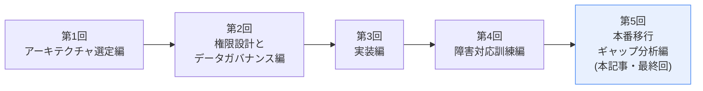
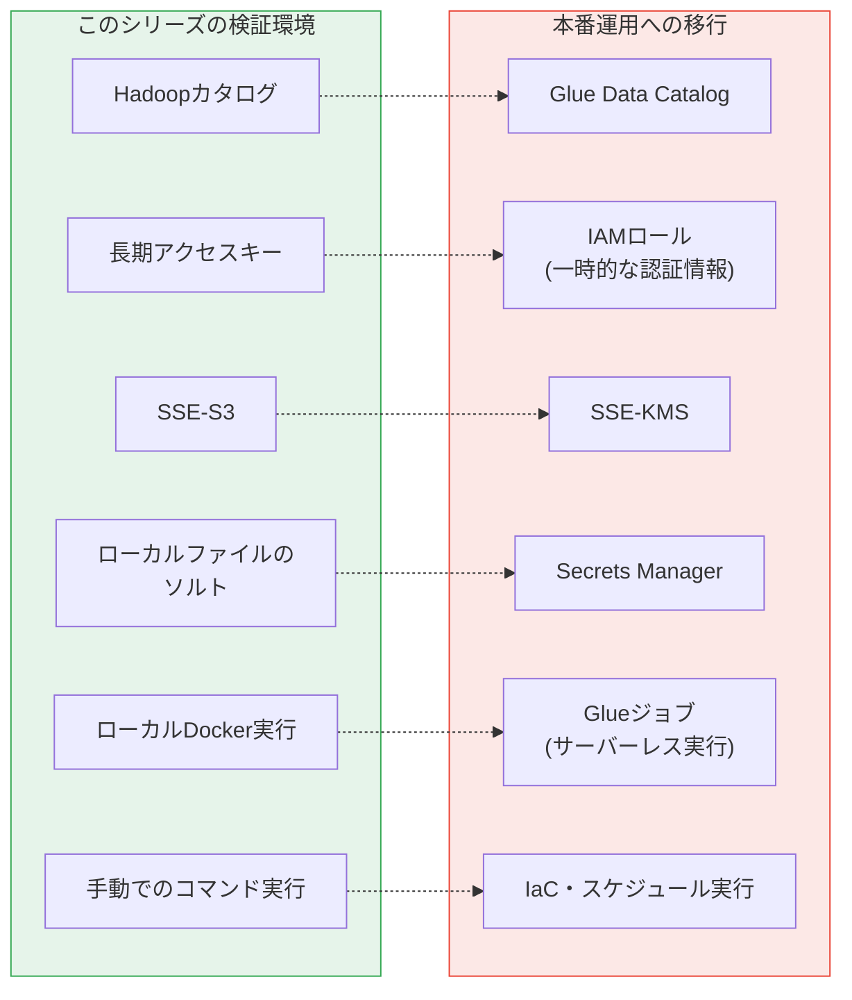

## 前回までのおさらい

ここまで4回にわたり、コストをかけずに、しかし本番の考え方を意識しながらS3×Icebergのデータ基盤を構築・検証してきました。各回では、そのつど「これは検証環境ならではの簡略化です」という注記を挟んできました。最終回となる今回は、その注記をすべて棚卸しし、**「このシリーズの範囲」と「本番導入に向けて追加で必要になるもの」の境界線**を、一枚のチェックリストとして整理します。

> ✅ **この記事(第5回)を読み終えると、こうなります**
> - このハンズオンで意図的に省略してきた項目を、**理由込みで**説明できる
> - 本番移行の際に、何から着手すべきかの**優先順位をつけられる**
> - 「個人の検証」と「組織のシステム」の間にある溝の正体を、具体的に言語化できる
>
> **前提知識**: 第1回〜第4回のハンズオンを完了していること。

## 全体像:検証環境と本番環境の対比

## ギャップ一覧

### ① カタログ: Hadoopカタログ → Glue Data Catalog

**第1回**で、コストゼロでの検証を優先し、Hadoopカタログ(S3上に直接カタログ情報を持つ方式)を選びました。

- **本番で必要になること**: Athena、QuickSight、他チームのSparkジョブなど、**複数のサービス・チームからテーブルを参照させたい場合、Glue Data Catalogへの登録がほぼ必須**です(第4回のQ&Aで扱った「AthenaでParquetの中身が見られない」問題は、まさにこれが原因でした)。
- **移行方法**: Icebergは複数カタログの併用構成(`spark.sql.catalog.hadoop_cat`と`spark.sql.catalog.glue_cat`を両方定義する等)や、既存テーブルのメタデータをGlue Data Catalogに登録し直す「カタログ移行」の手順が提供されています。段階的な移行が可能です。

### ② 認証: 長期アクセスキー → IAMロール(一時的な認証情報)

**第2回・第3回**を通して、`glue-etl-handson-user`という**長期のアクセスキー**を発行し、それをファイルやコンテナの環境変数として扱ってきました。実際に、アクセスキーを画面に映してしまう・書き留め忘れる・削除してしまうといったトラブルも発生しました。

- **本番で必要になること**: AWS Glueジョブとして実行する場合、**そもそも長期アクセスキーを発行する必要がありません。** Glueジョブには「実行ロール(IAM Role)」を割り当て、ジョブの実行時にAWSが自動的に発行する**一時的な認証情報**が使われます。これは有効期限が短く、盗まれても悪用できる時間が限られるため、長期アクセスキーより本質的に安全です。
- **今回、長期アクセスキーが必要だった理由**: ローカルのDocker(LXC上)から動かしていたため、AWS側が自動でロールを引き受けさせる仕組み(EC2のインスタンスプロファイルや、Glueジョブの実行ロールのような)を使えなかったためです。**「ローカル実行でコストを抑える」という今回の設計の代償**が、ここに表れています。

### ③ 暗号化: SSE-S3 → SSE-KMS

**第1回**で、追加コスト・追加の鍵管理の手間を避けるため、S3のデフォルト暗号化(SSE-S3)を選びました。

- **本番で必要になること**: SSE-KMSであれば、**鍵ごとにアクセス許可を分離**でき(「このKMSキーで復号できるのはこのロールだけ」という制御)、**鍵の利用履歴がCloudTrailに記録される**ため、監査上の説明力が上がります。金融機関のデータであれば、SSE-KMSが実質的な標準になります。
- **移行方法**: バケットのデフォルト暗号化設定を変更するだけで、新規オブジェクトから適用されます。既存オブジェクトの再暗号化には別途コピー処理が必要です。

### ④ シークレット管理: ローカルファイル → Secrets Manager / Parameter Store

**第3回**で、マスキング用のソルトを`masking_salt.txt`というローカルファイルに保存し、`docker run`時に環境変数として注入しました。この方式は「ハードコードしない」という最低限は満たしていますが、**ファイル自体がバックアップやログに紛れ込むリスク**が残ります。

- **本番で必要になること**: AWS Secrets ManagerかSSM Parameter Store(SecureString)にソルトを保存し、**ジョブの実行時にAPI経由で取得する**構成にします。取得できる権限は、実行ロール側のIAMポリシー(誰が読めるか)と、Secrets Manager側のリソースポリシー(このシークレット自体を誰に公開するか)の**両方**で絞り込めます。第2回のIAMポリシー設計と同様、「片方だけ絞って満足しない」ことが重要です。

### ⑤ 実行基盤: ローカルDocker → Glueジョブ / Glue Interactive Sessions

このシリーズの一番の特徴である「ローカル実行によるコストゼロ検証」自体が、本番では前提が変わります。

- **本番で必要になること**: コードが固まった後は、**AWS Glueジョブとしてデプロイし、スケジューラ(EventBridge等)で定期実行**させるのが基本です。開発中のインタラクティブな作業(第4回のQ&Aで触れた質問です)には、Glue Interactive SessionsやGlue Studio Notebookが使えますが、いずれも**DPU(処理能力の単位)に応じた課金**が発生します。具体的な単価は変動するため、実際に使う際はAWSの料金ページで最新の値を確認してください。
- **今回の位置づけ**: 「試行錯誤フェーズはローカルで無料、コードが固まったら本番のGlueへ」という開発フローそのものが、このシリーズの価値でした。この境界を自分の言葉で説明できることが重要です。

### ⑥ 権限分離の限界: Dockerグループ = root相当

**第3回**で正直に触れた通り、LXC上で`docker`グループに所属させたユーザーは、実質的にroot相当の操作が可能という、Dockerの構造的な制約が残っています。

- **本番で必要になること**: Glueジョブとして実行する場合、そもそもこの問題は発生しません(サーバーレスで、コンテナ管理をAWSが行うため)。もし引き続きコンテナ実行基盤が必要な場合は、rootless Docker、あるいはECS/Fargateのようなマネージドなコンテナ実行環境への移行で、この制約を回避できます。

> この種の「グループ名だけでは権限の強さが判断できない」問題は、Active Directoryでも同じ構図が起きます。「Domain Admins」のような分かりやすいグループでなくても、GPOの編集権限を持つグループやローカル管理者グループへの追加は、実質的にドメイン管理者に近い権限を渡してしまうことがあります。`docker`グループの名前だけを見て「コンテナを触れるだけ」と判断するのは、こうしたAD運用での落とし穴と同じ性質のミスです。権限の名前ではなく、**その権限が実際に何を可能にするか**で評価する習慣は、OSやクラウドが変わっても共通して必要になります。

### ⑦ バッチの冪等性: 重複実行防止の仕組みがない

**第4回**で、`transactions_etl.py`に何の防御機構もないまま、同じバッチを二重実行して事故を再現しました。これは意図的な実験でしたが、裏を返せば**本番のジョブには絶対に必要な仕組みが、今回のスクリプトには入っていない**ということです。

- **本番で必要になること**: 「同じデータを二重に書き込まない」ための冪等性の担保(例: 書き込み前に当日分の既存データを`DELETE`してから`INSERT`する、あるいはユニークな処理IDで実行済みかどうかをチェックする)、ジョブの多重起動を防ぐロック機構(Glueジョブの同時実行数を1に制限する設定等)が必要です。

### ⑧ スナップショットの自動整理: 手動 → スケジュール運用

**第4回**で、`history.expire.max-snapshot-age-ms`等のテーブルプロパティと`expire_snapshots`プロシージャの組み合わせを紹介しましたが、**「毎日実行するスケジューラ」自体は今回構築していません。**

- **本番で必要になること**: EventBridge(スケジュール)+ Glueジョブ(`expire_snapshots`を呼び出すだけの小さなジョブ)という構成で、日次の自動整理を組む必要があります。

### ⑨ 変更管理: 手書きテンプレート → ITSMツール連携

**第4回**で、復旧作業の承認テンプレートを表形式で書き出しましたが、これはあくまで**「何を記録すべきか」の練習**でした。

- **本番で必要になること**: 実際の組織であれば、ServiceNowやJiraのようなITSM(ITサービス管理)ツール上でチケットを起票し、承認ワークフローを経て、実施記録も自動的にそのチケットに紐づく、という運用が必要です。

> ツールが変わっても、記録すべき中身は自治体のBCP(事業継続計画)やインシデント対応の考え方と変わりません。「発生事象・影響範囲・対応方針・承認者・実施結果」を残すのは、システムが何であれ事後の振り返り(ポストモーテム)や監査対応に耐えるための最低限の要件です。ツールの導入以前に、**何を記録すべきかという型を持っているかどうか**の方が、実際には効いてきます。

### ⑩・⑪ 監視・アラート、IaC化(後続シリーズで扱います)

以下の2つは、それ自体で1本のシリーズが成立するボリュームがあるため、**本シリーズでは扱わず、後続の別シリーズとして扱う予定です。**

- **監視・アラート設計**: CloudTrailによるAPI呼び出しの記録、GuardDutyによる異常検知、Config Rulesによる「バケットが意図せずパブリックになっていないか」等の継続的なコンプライアンスチェック
- **IaC化**: 今回手動で実行したS3・IAM・ポリシーの作成を、Terraform等でコード化し、構成のドリフト(意図しない変更)を検知できるようにする

### ⑫ スケール検証: 数百件 → 実データ量での検証

第3回・第4回では、500件・60日分という、パーティション設計や集計突合を「見える化」しやすい規模のデータを使いました。実は、この規模自体がすでに**第2回で触れた「small file問題」の入り口**に立っています。1パーティションあたり平均8〜9件、ファイルサイズにして数KB程度のParquetファイルが60個できていたはずです。これは可視性を優先した結果であり、効率という点では褒められた状態ではありません。

- **本番で必要になること**: 実際の取引量(日次数万〜数百万件)であれば、1パーティションあたりのファイルサイズは自然に大きくなり、small file問題はむしろ起きにくくなります。逆に言えば、**「今回のような少量データでバッチを毎日回し続けると、小さなファイルが延々と積み上がる」**という、規模が小さいこと自体に起因する問題が出てきます。負荷試験に加えて、パーティション設計の見直し(`days`単位で本当に十分か)、コンパクション(小さなファイルを大きくまとめ直す運用)の頻度設計が必要です。

### ⑬ 第三者レビュー・複数チームでの同時利用

このシリーズは、個人による検証という前提で進めてきました。

- **本番で必要になること**: セキュリティチーム・データガバナンスチームなど第三者によるレビュー、複数チームが同じカタログ・同じテーブルに同時にアクセスする際の権限設計(読み取り専用ロール、書き込みロールの使い分け等)、テーブルへの同時書き込みが発生した場合のコンフリクト解決の考え方。

## まとめチェックリスト

| # | 項目 | 検証環境 | 本番で必要なもの | 扱った回 |
|---|---|---|---|---|
| ① | カタログ | Hadoopカタログ | Glue Data Catalog | 第1回・第4回 |
| ② | 認証 | 長期アクセスキー | IAMロール(一時認証情報) | 第2回・第3回 |
| ③ | 暗号化 | SSE-S3 | SSE-KMS | 第1回 |
| ④ | シークレット管理 | ローカルファイル | Secrets Manager等 | 第2回・第3回 |
| ⑤ | 実行基盤 | ローカルDocker | Glueジョブ | 第1回・第3回 |
| ⑥ | 権限分離の限界 | dockerグループ=root相当 | rootless / ECS・Fargate | 第3回 |
| ⑦ | バッチの冪等性 | なし | 重複防止・多重起動防止 | 第4回 |
| ⑧ | スナップショット整理 | 手動 | スケジュール自動実行 | 第4回 |
| ⑨ | 変更管理 | 手書きテンプレート | ITSMツール連携 | 第4回 |
| ⑩ | 監視・アラート | 未実装 | CloudTrail/GuardDuty/Config(後続シリーズ) | - |
| ⑪ | IaC化 | 手動CLI操作 | Terraform(後続シリーズ) | - |
| ⑫ | スケール検証 | 500件規模 | 実データ量での負荷試験 | 第3回・第4回 |
| ⑬ | 第三者レビュー | 未実施 | セキュリティ・ガバナンスチームのレビュー | - |

## シリーズ全体の振り返り

5回を通して、以下を一貫して意識してきました。

- **「なぜその選択をしたか」を、代替案・トレードオフ込みで記録すること**(第1回)
- **権限は「絞る」だけでなく、「絞られていることを失敗するテストで確認する」こと**(第2回)
- **マスキング・パーティション設計を、法的根拠や実データで裏付けること**(第2回・第3回)
- **障害対応を「コマンド一発」で終わらせず、検知・承認・実施・検証の手順として体験すること**(第4回)
- **省略した部分を、誤魔化さずにギャップとして明示すること**(第5回・本記事)

この記事だけを見て「もう本番導入できる」というレベルには、正直まだ届いていません。ですが、**「何が省略されているかを自覚した状態で、次に何を学ぶべきかが分かる」**というのは、個人の検証記事としては十分に価値のある到達点だと考えています。

読んでいただき、ありがとうございました。

## 後続シリーズ予告

- **シリーズ2**: CloudTrail・GuardDuty・Config Rulesで作る、Icebergデータ基盤の監視・アラート設計。今回「証跡は残るが誰も見ていない」状態だったスナップショット履歴を、実際に異常を検知して通知する仕組みまで作り込みます。
- **シリーズ3**: Terraformで再現する、今回のS3×IAM×Iceberg構成(IaC化編)。手順書としてではなく、コードとして環境を再現し、意図しない変更(ドリフト)を検知できる状態を目指します。
