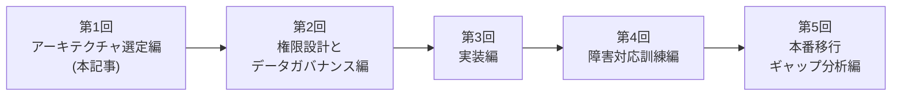
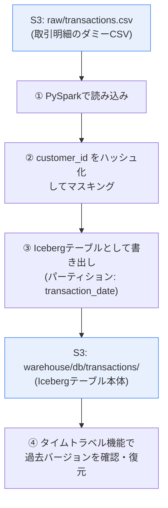
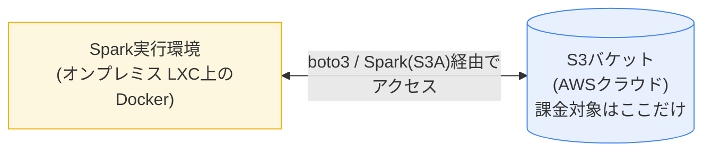
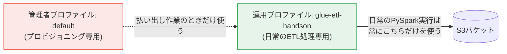

## この記事は誰のためのものか

この記事は、**金融機関の電算部門・システム部門で「クラウド上のデータ基盤(データレイク)を触ることになったが、何から手をつけていいかわからない」という新人・若手担当者**を対象にしています。

世の中には「AWS GlueとIcebergを触ってみた」という記事は数多くありますが、実際の業務で使うには次の観点が抜けていることがほとんどです。

- **なぜその技術を選んだのか**(比較検討のプロセス)
- **権限設計・監査ログなど、統制(ガバナンス)の観点**
- **本番運用するなら何が足りないのか**(検証環境と本番環境のギャップ)

この記事はこれらを省略せず、**新人担当者が記事だけを見ながら実際に手を動かして完走できるレベル**まで書き込みます。本記事内の画像は、実際にこのハンズオンを一度通しで実行した際の実機キャプチャです。

> 📝 **本記事の画像について**: Zennへの掲載時は、`images/`フォルダ内の画像をZennエディタにドラッグ&ドロップしてアップロードし、返却されたURLに差し替えてください。

> ✅ **この記事(第1回)を読み終えると、こうなります**
> - Iceberg / Delta Lake / Hudiのどれを選ぶべきか、自組織の状況に当てはめて**自分の言葉で説明できる**
> - Glue Data CatalogとHadoopカタログの違いを理解し、**どちらを選ぶべきか判断できる**
> - 管理者権限と運用権限を分離した状態で、**FISC安全対策基準を意識したS3バケットを実際に構築できている**
>
> **前提知識**: AWS CLIの基本的な操作(コマンドを実行したことがある程度)、S3・IAMの用語(バケット、IAMユーザーという言葉を聞いたことがある程度)。Spark/Icebergの知識は前提としません。

## この記事の位置づけ:FISC安全対策基準との関係

日本の金融機関がシステムのセキュリティ対策を検討する際の実務上の拠り所として、公益財団法人金融情報システムセンター(FISC)が策定する「金融機関等コンピュータシステムの安全対策基準・解説書」(以下、FISC安全対策基準)があります。法的な強制力はありませんが、金融庁の検査でも参照される事実上の業界標準であり、電算部門であればまず名前を知っておくべきものです。

FISC安全対策基準は「統制基準」「実務基準」「設備基準」「監査基準」の4編・約300項目で構成されています(2024年時点の最新は第11版)。本シリーズで扱う内容は、大まかに次のように対応します。

| 本シリーズでの実施内容 | FISC安全対策基準での位置づけ(編) |
|---|---|
| 権限分離(プロビジョニング用/運用用)、IAM最小権限設計(第2回) | 実務基準(アクセス管理) |
| バージョニング・暗号化・パブリックアクセスブロック(本記事) | 実務基準(情報の保護)/設備基準 |
| Icebergスナップショットを使った変更履歴の追跡(第4回) | 監査基準(証跡の確保) |
| タイムトラベルによる復旧演習(第4回) | 実務基準(障害対策・回復) |

> ⚠️ **注意**: 本シリーズはFISC安全対策基準への準拠を保証・証明するものではありません。個々の項目への適合可否を正式に判断する際は、AWSが公開している「金融リファレンスアーキテクチャ日本版」や、FISC対応APNコンソーシアムが公開する対応リファレンスなど、公式資料を確認してください。本シリーズの目的は、あくまで**「FISCが求めるような統制の考え方を、手を動かしながら体感すること」**です。

## エビデンス(証跡)取得の進め方

実務では、作業を実施した証拠(エビデンス)を残すことが統制上必須です。本シリーズでも、各ステップで「何を証跡として残すべきか」を明記します。基本ルールとして:

- **コマンドとその実行結果が両方写ったスクリーンショット**を、コマンドを打つたびに保存する(PowerShellの画面をそのままキャプチャすればOK)
- ファイル名は `YYYYMMDD_第N回_ステップ番号.png` のように、いつ・どの回の・どの作業かがわかる命名にする(例: `20250906_01_1-8.png`)
- 実務では、この証跡を変更申請書・作業記録と紐づけて保管するのが基本です。本ハンズオンでは申請書までは扱いませんが、「後から第三者が見て、いつ誰が何を実行したか追跡できる状態を作る」という意識だけは持って進めてください。

## シリーズ構成

全5回の構成を予定しています。

| 回 | タイトル | 内容 |
|---|---|---|
| 第1回(本記事) | アーキテクチャ選定編 | なぜIceberg/Hadoopカタログか、コスト試算、S3バケット構築 |
| 第2回 | 権限設計とデータガバナンス編 | IAM最小権限設計、マスキング処理、パーティション設計 |
| 第3回 | 実装編 | PySparkスクリプト実装、ダミーデータ準備、実行検証 |
| 第4回 | 障害対応訓練編 | Icebergタイムトラベルを使った復旧演習 |
| 第5回 | 本番移行ギャップ分析編 | 検証環境と本番環境の差分、移行チェックリスト |



なお、本シリーズでは**監視・アラート設計(CloudTrail/GuardDuty/Config Rules)**と**IaC化(Terraformによる構成のコード化)**は扱いません。これらはそれぞれ単独でシリーズ化する価値のあるテーマのため、本シリーズの完走後、別シリーズとして扱う予定です。

## この検証で作るもの

最終的に、以下のようなデータの流れを作ります。



計算処理(Spark)はすべて **オンプレミス側(Proxmox上のLXCコンテナ)** で実行し、AWS側で発生する課金は **S3のストレージ代のみ** に抑えます。これにより、本番同等のS3/IAM操作を、ほぼ無料で・何度でも失敗しながら練習できます。

## なぜApache Icebergを選んだか

データレイクのテーブルフォーマットには、代表的に **Apache Iceberg / Delta Lake / Apache Hudi** の3つがあります。この検証ではIcebergを選びました。理由を整理します。

| 観点 | Apache Iceberg | Delta Lake | Apache Hudi |
|---|---|---|---|
| エンジン中立性 | Spark/Trino/Flink/Athenaなど幅広く対応 | Databricks/Sparkが主戦場。他エンジン対応は後発 | Sparkが中心。他エンジン対応は限定的 |
| カタログの柔軟性 | Hadoop/Glue/Hive/REST等、複数方式を選べる | Delta Log中心で、他カタログとの統合はやや弱い | 独自のタイムライン管理が中心 |
| スキーマ進化 | 列の追加・削除・型変更・**パーティション進化**に強い | スキーマ進化は対応済みだが、パーティション変更は再作成が必要な場合がある | 対応しているが構成がやや複雑 |
| 監査・変更履歴の扱いやすさ | スナップショットにメタデータが残り、`system.snapshots`等で追跡しやすい | 同様にタイムトラベル可能 | 同様にタイムトラベル可能 |

比較表だけでなく、**それぞれがどういう経緯で生まれ、誰が使っているか**も判断材料になります。

- **Apache Iceberg**: Netflix社内で2017年頃に開発され、2018年にApache Software Foundationへ寄贈、2020年にApacheのトップレベルプロジェクトへ昇格しました。「特定ベンダーに依存しない、複数エンジンから安全に読み書きできるテーブルフォーマット」という設計思想がもともとの開発動機で、Apple、LinkedIn、Adobe等、複数エンジン・複数チームでデータレイクを共有する大規模組織での採用事例が公開されています。
- **Delta Lake**: Databricks社が開発し、2019年にOSS化しました。Databricks(Spark)を中核に据えた基盤との親和性が高く、Z-Ordering等Databricksプラットフォーム前提の最適化機能が強みです。
- **Apache Hudi**: Uber社が開発し、2017年にOSS化しました。頻繁な更新・削除(Upsert/CDC)が発生するストリーミング的なワークロードに強みがあります。

**「複数のエンジン・チームから、特定ベンダーに縛られずデータを読み書きできること」を優先する組織で生まれた**、という成り立ちが、金融機関のようにベンダーロックインを避けたい組織の要件と合致しやすい、というのがIcebergを選ぶ根拠の一つです。ただし、これは一般的な傾向であり、自組織がすでにDatabricksを中核とした基盤を持っているのであれば、Delta Lakeの方が導入コストは低くなります。

金融機関のシステムでは、**特定ベンダーのエンジンに依存しない**こと、そして**将来テーブル設計を変更しても過去データを作り直さずに済む**ことが重要です。特に「パーティション進化」(後述、第2回で詳しく扱います)は、一度稼働を始めたテーブルを止めずに設計変更できるという点で、ミッションクリティカルな基盤との相性が良いと考え、Icebergを採用しました。

なお、Delta LakeやHudiが劣っているという意味ではありません。実際にDatabricksを中核に据えた基盤であればDelta Lakeの方が自然な選択になります。**「自組織の技術スタック次第で最適解は変わる」という前提込みで、今回はIcebergを選んだ**、という比較検討の過程自体を記録として残すことが重要だと考えています。

## なぜHadoopカタログを選んだか(Glue Data Catalogではなく)

Icebergを使う場合、テーブルのメタデータ(どのファイルがどのスナップショットに属するか等)を管理する「カタログ」が必要です。AWS上では**AWS Glue Data Catalog**を使うのが一般的ですが、この検証では**Hadoopカタログ**(カタログ情報をS3上に直接持たせる方式)を採用します。

| 観点 | Glue Data Catalog | Hadoopカタログ |
|---|---|---|
| 追加コスト | Glueのテーブル数・API呼び出しに応じて課金 | 課金なし(S3ストレージ代のみ) |
| 追加のIAM権限 | Glue用の権限が別途必要 | S3権限のみで完結 |
| 他サービスとの連携(Athena等) | 容易に連携可能 | 連携には追加設定が必要 |
| マルチエンジンでの同時利用 | カタログを中心に複数エンジンから安全に参照可能 | 複数エンジンからの同時書き込みには工夫が必要 |

**この検証はコストゼロでの練習が目的**のため、Glueのカタログ利用料・API呼び出し課金が発生しないHadoopカタログを選びます。ただし、これは検証環境ならではの簡略化です。本番でAthenaや他チームとテーブルを共有する運用を考えるなら、Glue Data Catalogへの移行はほぼ必須になります。この点は第5回(本番移行ギャップ分析編)で改めて扱います。

> 💡 **補足:ここで言う「Hadoop」とは何か**
> 「Hadoopカタログ」という名前だけ見ると、HDFSやYARNを使った大掛かりなHadoopクラスタを新たに構築する必要があるように思えるかもしれませんが、**そうではありません。** ここでの「Hadoop」は、Apache Hadoopプロジェクトが定めた**ファイルシステムの抽象化API**(`org.apache.hadoop.fs.FileSystem`)を指しています。
>
> このAPIは元々HDFS(Hadoop Distributed File System)を操作するために作られたものですが、同じプロジェクトが提供する`S3AFileSystem`という実装を使うと、**S3をあたかも1つのファイルシステムであるかのように、同じAPIで読み書きできます。** IcebergのHadoopカタログは、この抽象化レイヤーを経由してS3上にメタデータファイル(`v1.metadata.json`、`v2.metadata.json`のように、バージョンごとに新しいファイルを作る方式)を読み書きしているだけで、**HDFSクラスタや専用サーバーは一切必要ありません。** 今回の構成でSparkの実行ログに`S3AFileSystem`や`HadoopFileIO`といったクラス名が登場するのは、このためです。

## コスト試算

「本当にほぼゼロ円で検証できるのか」を数字で確認しておきます。

**この検証環境でかかる費用(月額の概算)**

- S3ストレージ: ダミーデータ数十行 + Icebergメタデータ ≒ 数MB → **月数円未満**
- S3 PUT/GETリクエスト: ハンズオンで数百回操作しても数円程度
- Glue/EMR等の計算課金: **発生しない**(計算はすべてローカルLXCで実行するため)

**仮に同じ処理をAWS Glueジョブ(DPU課金)で実行した場合の概算**

- Glue 5.0(Spark)の最小構成(2 DPU)を10分実行 × 1日数回のバッチを想定した場合、DPU時間単価から算出すると、月あたり数百〜数千円規模になり得ます(実行頻度・DPU数次第で変動)。
- 開発中の試行錯誤(コード修正→再実行を何十回も繰り返す)をすべてGlueジョブ上で行うと、地味にコストが積み上がります。

つまり、**「本番と同じコードをローカルで動かして検証し、動作確認が取れたものだけを最終的にGlueジョブとしてデプロイする」**という開発フローを取ることで、試行錯誤フェーズのコストをほぼゼロにできます。これは個人の検証目的だけでなく、実務のコスト最適化の考え方としてもそのまま使えます。

## 検証環境の全体像



Spark実行環境の内訳は以下の通りです。

- Proxmox VE 2台構成(`pve`: 192.168.11.150 / `pve2`: 192.168.11.151)
- LXCコンテナ(CT200, `docker-etl`, IP: 192.168.11.200)上にDockerを導入
- `amazon/aws-glue-libs:5`イメージを使用(AWS GlueのSparkジョブと同一構成のコンテナを、ローカルで実行できるイメージ)
- コンテナ内で`pyspark --version`を実行し、`Spark 3.5.4-amzn-0`の起動を確認済み

この部分の構築手順(オフライン環境でのDocker導入、AppArmor制約への対応など)は本シリーズの主題ではないため、詳細は割愛します。ポイントは、**AWS Glueジョブとほぼ同一のSpark実行環境を、AWS外(オンプレミス)に再現している**という点です。これにより、Glueジョブとしてデプロイする前提のコードを、課金なしで何度でも試行錯誤できます。

## ハンズオン Step 0: AWS CLIの前提確認

ここから実際に手を動かします。作業はWindows PC側のPowerShellで行います。

### 0-1. AWS CLIのインストール確認

```powershell
aws --version
```

`aws-cli/2.x.x` のようなバージョンが表示されればインストール済みです。表示されない場合は、[AWS公式のインストーラ](https://awscli.amazonaws.com/AWSCLIV2.msi)からインストールしてください。

### 0-2. 既存プロファイルの確認

すでに個人の管理者IAMユーザーで`aws configure`済みの環境を使う想定です。既存の設定を壊さないよう、まず現在のプロファイル一覧を確認します。

```powershell
aws configure list-profiles
```


`default`という名前のプロファイルが表示されるはずです(環境によっては`admin`など別名で登録されている場合もあります。その場合は以降のコマンド例をご自身の名前に読み替えてください)。**この後の作業では、この既存プロファイルを一切上書きしません。** すべて`--profile`オプションで明示的に指定します。

> 💡 **なぜプロファイルを明示するのか**
> 実務では「うっかりデフォルトプロファイル(=強い権限)でコマンドを打ってしまい、意図しない環境を操作してしまう」事故が起こりがちです。金融機関のシステムでは「今どの権限で操作しているか」を常に意識する習慣が重要なので、この検証でも最初から`--profile`を明示する書き方を徹底します。

## ハンズオン Step 1: S3バケットの作成

ここからの作業は、**プロビジョニング(環境払い出し)作業**として、既存の管理者プロファイル(本記事では例として`default`という名前を使います。実際にはStep 0-2で確認したご自身のプロファイル名に読み替えてください)で実行します。

> ⚠️ 以降のコマンド例では `--profile default` としていますが、Step 0-2で確認したご自身のプロファイル名に置き換えてください。

この先、本シリーズ全体を通して次のような権限分離を維持します。**「誰が」「どの権限で」「何をしているか」を常に意識する**ことが、金融機関のシステムでは特に重要です。



それぞれのプロファイルが担当する作業は以下の通りです。

| プロファイル | 担当する作業 |
|---|---|
| `default`(管理者) | S3バケット作成・設定(第1回)、IAMポリシー作成(第2回)、IAMユーザー作成・アクセスキー発行(第2回) |
| `glue-etl-handson`(運用・第2回で作成) | S3の読み書き(`raw/`, `warehouse/`のみ) |

**ポイント**: `default`は「環境を用意する人」、`glue-etl-handson`は「日々データを処理する人(実際にはPySparkスクリプト)」という役割分担です。本番の銀行システムでも、環境構築を行う運用担当者と、実際にバッチを実行するサービスアカウントは権限を分けるのが基本であり、この構造を最初から体に染み込ませておくことに意味があります。

### 1-1. バケット名を決める(一度だけ生成し、以降固定します)

S3バケット名は全世界で一意である必要があるため、固定の名前だと衝突する可能性があります。ここでランダムな文字列を1回だけ生成し、**このシリーズを通して同じ名前を使い続けます**。

```powershell
# ランダムな8文字の英数字を生成してバケット名を作る(このコマンドは1回だけ実行する)
$suffix = -join ((48..57) + (97..122) | Get-Random -Count 8 | ForEach-Object {[char]$_})
$bucket = "glue-etl-handson-$suffix"
Write-Output $bucket
```

> 📌 **本記事での表記について**
> 以降のコマンド例では、上記で生成された値の一例として `glue-etl-handson-abcd1234` を使って記載します。
> ```powershell
> $bucket = "glue-etl-handson-abcd1234"
> ```
> **実際にはStep 1-1でご自身の環境に表示された値に読み替えてください。** 第2回以降のコマンド例・IAMポリシーのARN表記なども、すべてこの例のバケット名(`glue-etl-handson-abcd1234`)で統一して記載しますが、必ずご自身が生成した値に置き換えて実行してください。
>
> PowerShellのセッションを閉じると`$bucket`変数の値は消えます。エビデンス取得の都合上、生成したバケット名は別途メモ帳等に控えておくことをお勧めします。

### 1-2. バケットを作成する

リージョンは東京(`ap-northeast-1`)を使います。

```powershell
aws s3api create-bucket `
  --bucket $bucket `
  --region ap-northeast-1 `
  --create-bucket-configuration LocationConstraint=ap-northeast-1 `
  --profile default
```

コンソールで確認すると、バケットが東京リージョンに作成されていることがわかります。


> 💡 **画面右上のIAMユーザー名について**: コンソールの右上には、実際にログインしているIAMユーザー名が表示されます。これが、Step 0-2で確認したCLIプロファイル名(`default`)とは**別物**であることに注目してください。「IAMユーザー名」は誰がログインしているかを示す実体名、「プロファイル名」はその認証情報をローカルPCでどう呼び出すかというラベルです。両者はたまたま一致することもありますが、一致するとは限りません。

### 1-3. バージョニングを有効化する

Icebergはスナップショット単位でメタデータファイルを追加していく仕組みのため、バケットのバージョニング自体は必須ではありませんが、**「誤ってオブジェクトを削除・上書きしてしまった場合の保険」**として、金融機関のシステムでは有効化しておくのが基本です。

```powershell
aws s3api put-bucket-versioning `
  --bucket $bucket `
  --versioning-configuration Status=Enabled `
  --profile default
```

コンソールの「プロパティ」タブでも、バケットのバージョニングが「有効」になっていることが確認できます。


### 1-4. パブリックアクセスを完全にブロックする

デフォルトでも非公開ですが、明示的にブロック設定を入れておきます。金融機関の検査対応でも「明示的に設定されていること」自体が重要視されます。

```powershell
aws s3api put-public-access-block `
  --bucket $bucket `
  --public-access-block-configuration `
  BlockPublicAcls=true,IgnorePublicAcls=true,BlockPublicPolicy=true,RestrictPublicBuckets=true `
  --profile default
```

### 1-5. デフォルト暗号化を有効化する

保存データの暗号化(SSE-S3)を有効にします。

> 💡 **すでに暗号化されているように見える場合**: 2023年以降、S3は新規バケットに対して自動的にSSE-S3による暗号化を適用するようになりました。そのため、このコマンドを実行する前にコンソールを確認すると、すでに暗号化が有効になっているように見えることがあります(下図はコマンド実行前の状態で、タグは0個ですが暗号化はすでにSSE-S3になっています)。それでも、**「自動適用に任せる」のと「明示的に設定する」のは統制上の意味が異なります**。後から見直したときに「意図して設定したのか、たまたまデフォルトで有効だっただけなのか」が区別できるよう、このコマンドは省略せずに実行してください。
>
> 

> ⚠️ **よくあるつまずきポイント: PowerShellでのJSONエスケープ**
> Bash(Linux/Mac)の記法に慣れていると、JSON文字列を渡す際に`\"`のようにダブルクォートをバックスラッシュでエスケープしたくなりますが、**PowerShellのシングルクォート`'...'`は中身を完全に文字列そのままとして扱うため、バックスラッシュのエスケープは不要かつ誤りです。** 以下のように書くと構文エラーになります。
>
> 
>
> ```
> aws: [ERROR]: An error occurred (ParamValidation): Error parsing parameter '--server-side-encryption-configuration':
> Invalid JSON: Expecting property name enclosed in double quotes: line 1 column 2 (char 1)
> ```
>
> 正しくは、ダブルクォートをそのまま(バックスラッシュなしで)シングルクォートの中に書きます。

```powershell
aws s3api put-bucket-encryption `
  --bucket $bucket `
  --server-side-encryption-configuration '{"Rules":[{"ApplyServerSideEncryptionByDefault":{"SSEAlgorithm":"AES256"}}]}' `
  --profile default
```

> 💡 本番であれば、鍵管理・アクセス制御をより厳密に行える**SSE-KMS**(カスタマー管理キー)を使うのが一般的です。今回はKMSキー管理までは検証範囲外とし、SSE-S3で簡略化しています。この点も第5回のギャップ分析で扱います。

### 1-6. タグを付与する

コスト管理・棚卸しのため、プロジェクトタグを付けます。

```powershell
aws s3api put-bucket-tagging `
  --bucket $bucket `
  --tagging 'TagSet=[{Key=Project,Value=glue-etl-handson}]' `
  --profile default
```

コンソールで確認すると、タグが反映され、暗号化(SSE-S3)も明示的に設定された状態になっています。


### 1-7. プレフィックス(フォルダ相当)の設計

S3に実体としてのフォルダはありませんが、運用上の区分としてプレフィックスを切っておきます。

| プレフィックス | 用途 |
|---|---|
| `raw/` | 加工前の生データ(取引明細CSVなど)を置く |
| `warehouse/` | Icebergテーブル本体(データファイル・メタデータ)を置く |

```powershell
# 空オブジェクトを置いてプレフィックスを可視化しておく(必須ではないが運用上わかりやすい)
aws s3api put-object --bucket $bucket --key "raw/" --profile default
aws s3api put-object --bucket $bucket --key "warehouse/" --profile default
```

### 1-8. 設定内容の確認

最後に、意図通りに設定されているか確認します。

```powershell
aws s3api get-bucket-versioning --bucket $bucket --profile default
aws s3api get-bucket-encryption --bucket $bucket --profile default
aws s3api get-public-access-block --bucket $bucket --profile default
aws s3 ls "s3://$bucket/" --profile default
```


`raw/`と`warehouse/`が表示されれば準備完了です。

> 📸 **証跡として残すもの**: 上記4つのコマンドとその出力結果は、すべてスクリーンショットで保存してください。これは「バケットが意図した設定(バージョニング有効・暗号化有効・パブリックアクセス完全ブロック)で作成されたことを、後から第三者が確認できる」ための証跡になります。ファイル名は `20250906_01_1-8.png` のように、実際の作業日に置き換えてください。

## この回のまとめ

- Iceberg / Hadoopカタログを選んだ理由を、**代替案との比較・トレードオフ込みで**整理した
- ローカル実行によるコストメリットを、**概算金額で**示した
- 「プロビジョニング作業は管理者権限、日常運用は最小権限」という**権限分離の考え方**を最初から導入した
- 本シリーズの取り組みを**FISC安全対策基準の4編**(統制・実務・設備・監査基準)のどこに対応するかという視点で整理した
- S3バケットを、**バージョニング・暗号化・パブリックアクセスブロックを明示的に設定した状態**で作成し、その**証跡を残す**ところまで一連の作業とした

## 次回予告

第2回では、いよいよ今回作成したバケットに対する**IAM最小権限ポリシー**を設計し、`glue-etl-handson-user`を作成します。あわせて、`customer_id`のマスキング処理の実務的な設計と、Icebergテーブルの**パーティション設計**についても扱います。
