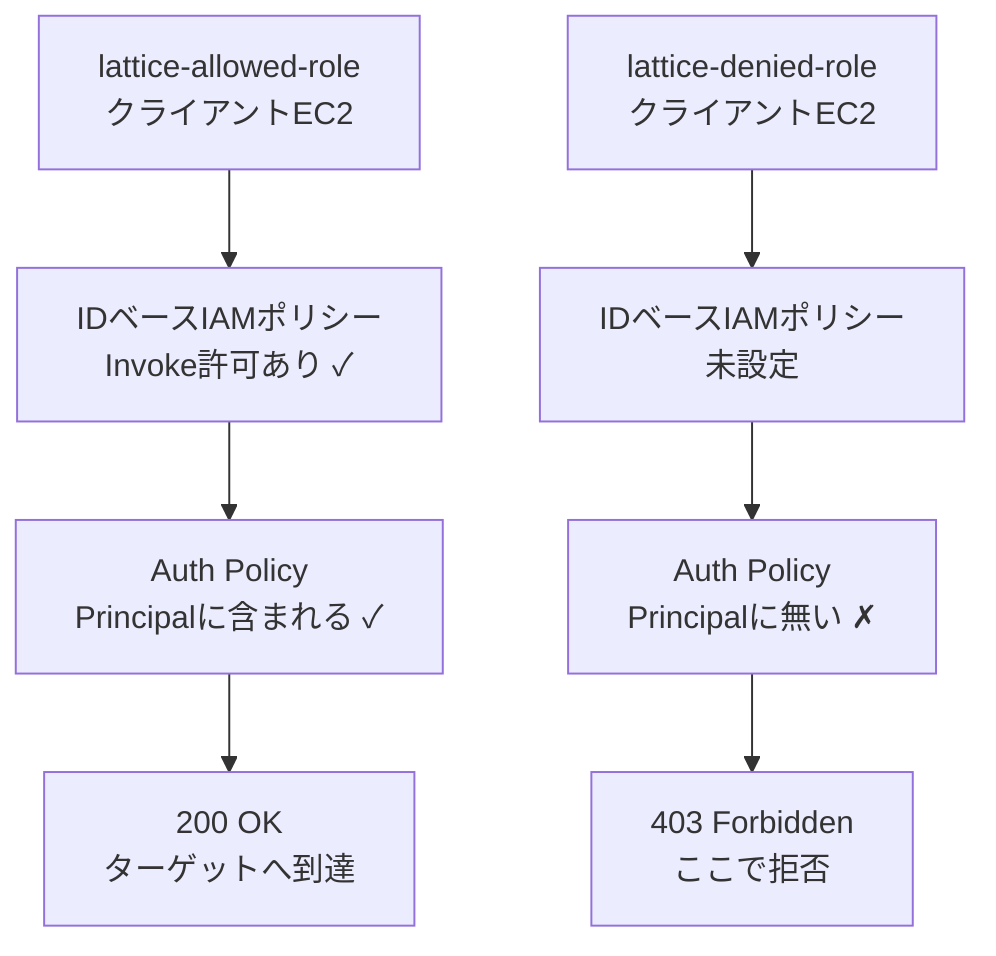

# Security Groupの先へ ― VPC Lattice Auth Policyでネットワーク到達性とアクセス認可の分離を検証する


## 出発点：この検証を始めた理由

AIを使った異常検知の導入を検討する文脈で、ゼロトラストの話が出た。その流れで「マイクロセグメンテーションを体感するハンズオンを組むなら何がいいか」を考えていて、最初に思い浮かんだのはこういう構成だった。

- 同じサブネットにWebサーバー、DBサーバー、攻撃者役の端末を置く
- DBのSecurity Group（SG）で「WebのSGからの3306のみ許可」にする
- 攻撃者役からDBに繋がらないことを確認する

同一サブネット内でも通信が止まることは確認できるので、ハンズオンとしては成立する。ただ書き出してみて引っかかった。

**これはIPアドレスとポート番号による制御であって、従来のACLを細かく適用したものと何が違うのか。**

NIST SP 800-207で示されるゼロトラストの考え方では、アクセス要求ごとにポリシーに基づいて認可判断を行う。今回の検証では、その考え方をIAMプリンシパルによるVPC Latticeの認可で小さく検証する。SGはネットワーク経路の静的な制御であって、**送信元が誰のクレデンシャルで動いているかを一切問わない**。一度条件を満たせば、その先は素通りになる。

オンプレミスのファイアウォールで「このセグメントからこのセグメントへ」を書いていた頃と、思考の構造が変わっていない。アイデンティティで判断していないからだ。

そこで、「ネットワーク的には到達できるが、アイデンティティが違えば拒否される」状態を実機で作って確認することにした。本記事はその検証記録である。

:::message
本記事の内容はすべて個人のAWS検証環境（AWS Organizations配下のメンバーアカウント）で実施したもので、業務での本番環境における実施ではない。
:::

---

## 何を検証するか

**ネットワーク到達性とアクセス権が、別のレイヤーとして分離していることを実機で確認する。**

具体的には、次の状態を作る。

- クライアントEC2を2台用意し、**同じVPC・同じサブネット・同じSecurity Group・同じService Network**に所属させる
- 違いは、アタッチしているIAMロールだけにする
- 一方は200で通り、もう一方は403で拒否される状態を作る

SGが「門番」だとすれば、これから設定するAuth Policyは「受付での身分証確認」にあたる。両者は別のレイヤーで機能し、どちらか一方では成立しない。この点を確認するのが目的である。

検証する構成の全体像を先に示しておく。


*同じVPC・同じサブネット・同じSGでも、IAMロールによってアクセスを制御する*

図の①②③が、この記事で確認する3つのレイヤーにあたる。

| # | レイヤー | 何を見ているか | 失敗したときの症状 |
|---|---|---|---|
| ① | ネットワーク到達性 | SGが送信元を許可しているか | タイムアウト |
| ② | Auth Policy（リソースベース） | Principalが許可リストにあるか | 403 / `service-based policy` |
| ③ | IDベースIAMポリシー | ロール自体にInvoke権限があるか | 403 / `identity-based policy` |

①だけを見て設計してしまうのが、従来のSG中心の発想である。②③を加えることで何が変わるかを、実機で確認していく。

---

## 脅威・課題：SGだけでは防げないもの

想定する脅威はシンプルで、**同一VPC内のEC2が1台侵害されたケース**である。

SGの観点では、そのインスタンスは正規の通信経路にいる。ネットワーク的に到達可能である以上、他サービスへの攻撃の足がかりになり得る。これはオンプレミスで「同じセグメントのPCがマルウェアに感染すると、そこを踏み台に他のサーバーへ到達できてしまう」という、SOC運用で何度も見た構造とまったく同じである。

IAMベースの認可は、ネットワーク的に通信可能であることとは別のレイヤーで、SigV4署名によるリクエスト単位のアイデンティティ検証をもう一段かける。侵害されたインスタンスに、許可されたIAMロールの認証情報がなければ、ネットワーク的に届いていても呼び出しは拒否される。

---

## 設計判断：なぜIAMベースの都度認可なのか

AD管理者として権限設計をしていた頃の感覚で言うと、この構造には既視感がある。

**ADでは、ドメインに参加しているだけでは何のリソースにもアクセスできない。** 個別にACLで許可されて初めてアクセスできる。「ネットワークに繋がっていること」と「アクセスが許可されていること」が明確に別の概念として扱われている。

一方、クラウドのネットワーク設計では、この2つが混同されやすい。「VPCの中にいる＝信頼できる」という、場所ベースの信頼に無意識に寄りかかってしまう。

IAMポリシーはデフォルト拒否（暗黙のDeny）であり、明示的なAllowが無い限り通らない。この性質を使って、「ネットワーク的にどれだけ近くても、名簿に無ければ通さない」状態を作る。場所ベースの信頼から、アイデンティティベースの信頼への転換を、小さいスケールで体感するのが狙いである。

---

## AWSサービスの選定：VPC Lattice Auth Policy

候補として最初に検討したのはAWS Verified Accessだった。IDプロバイダーとデバイスの信頼スコアに基づく都度認可を行うサービスで、デバイス信頼プロバイダーとしてJamf、CrowdStrike、JumpCloudをサポートしている。CrowdStrikeのFalconセンサーが出すエンドポイントのセキュリティポスチャを、そのままアクセス判断に使える。

SOCでCrowdStrikeを扱っていた経験と直接つながる構成で、題材としては魅力的だった。ただし2点、個人検証としては現実的でない。

1. CrowdStrikeの無料トライアルは法人利用を前提としており、個人の検証用途で継続的に使うものではない
2. Verified Accessのエンドポイントは、**公開ドメイン名とそれに一致するACM証明書が必須**で、読者が再現する際のハードルが高い

そこで**VPC Lattice の Auth Policy** に切り替えた。

| 観点 | VPC Lattice Auth Policy | AWS Verified Access |
|---|---|---|
| 独自ドメイン | 不要（自動生成ドメイン＋TLS込み） | 必須（ACM証明書も必要） |
| 第三者アカウント | 不要（IAMのみ） | デバイス信頼を使うなら契約が必要 |
| 認可の主体 | IAMプリンシパル（サービス間・SigV4） | ユーザーID＋デバイス状態 |
| 料金目安 | $0.025/service/時間 ＋ $0.025/GB | $0.27/app時間（HTTP）＋ $0.02/GB |
| 再現しやすさ | AWSアカウントのみで完結 | ドメイン取得・証明書検証が前提 |

VPC Latticeは「ユーザーがブラウザでアプリにアクセスする」文脈ではなく、**サービス間（ワークロードのIAMアイデンティティ）の認可**という切り口になる。検証したかった「アイデンティティによる都度認可」の核心は同じで、かつ追加コストがほぼゼロで再現できる。

- [Amazon VPC Lattice ユーザーガイド](https://docs.aws.amazon.com/vpc-lattice/latest/ug/what-is-vpc-lattice.html)
- [AWS Verified Access](https://docs.aws.amazon.com/verified-access/latest/ug/what-is-verified-access.html)

---

## VPC Latticeの構成要素を整理する

VPC Latticeは3つのコンポーネントで構成される。初見では関係がつかみにくいので、会社の代表電話・受付システムに例えて整理する。

| コンポーネント | たとえ | 本検証での実体 |
|---|---|---|
| Target Group | 実際に対応する担当者 | httpdが動くEC2 |
| Service | 会社の代表電話番号・受付窓口 | 自動生成ドメインを持つエンドポイント |
| Service Network | ビル全体の内線網（PBX） | VPCとServiceを関連付けるハブ |

Serviceには外から見える唯一の連絡先（`xxxx.vpc-lattice-svcs.ap-northeast-1.on.aws`）が割り当てられ、Listenerのルールに従って担当者（Target Group）へつなぐ。Service Networkは、どのVPCがこの内線網に加入しているかを管理する。

そしてここからが本題になる。今回の構成では、受付を通るために**2種類のチェックを両方通過する必要がある**。

- **受付側の来客リスト（Auth Policy）**：「この名札を付けた人は通していい」という、受付が持っているリソースベースのポリシー
- **本人の入館証の権限（IDベースIAMポリシー）**：名札（IAMロール）自体に「この受付を通っていい」という権限が焼き込まれている必要がある



:::message
この2つのチェックには順序があるわけではなく、**両方がAllowでなければ通らない（AND条件）**。片方でも拒否があればアクセスは成立しない。図は便宜上縦に並べているが、評価順序を示すものではない。
:::

この「片方だけでは通らない」という仕様は、実際にハマるポイントでもある。後述する。

---

## 検証環境

- AWS Organizations配下のメンバーアカウント1つ（検証専用に新規作成）
- リージョン：東京（ap-northeast-1）
- VPC・サブネット・IGW・ルートテーブルはゼロから作成
- EC2 t3.micro × 3台（ターゲット1台、クライアント2台）
- 操作はすべてWindows上のPowerShell + AWS CLI v2
- EC2への操作はSSM Run Command経由（SSHログインなし）

構成のポイントは、**クライアント2台をネットワーク的に完全に対等にすること**にある。同じサブネット、同じSecurity Group、同じService Networkに所属させ、違いをIAMロールだけに絞る。

:::message
EC2への接続にSSHではなくSystems Manager（Run Command）を使っているのは、SSH鍵の管理とポート22の開放を避けるため。これ自体も「ネットワーク到達性ではなくアイデンティティで接続を制御する」という本記事のテーマと一致している。
:::

---

## 事前準備：実行用IAMユーザーの作成

検証用メンバーアカウントへは、管理アカウント側のIAMユーザーから`OrganizationAccountAccessRole`をAssumeRoleして入る。長期のアクセスキーをメンバーアカウント側に置かず、一時認証情報だけで作業を完結させる構成にする。

:::message alert
注意：認証情報が何もない状態から、CLIだけでIAMユーザーを新規作成することはできない。IAMユーザーを作るには、作るための権限を持つ既存の認証情報が必要になる。手元に管理者権限を持つプロファイルが無い場合、この最初の1回だけはルートユーザーでのサインインが避けられない。
:::

ブラウザでの操作を最小限にするため、サインイン後はCloudShellでCLI操作する。

1. マネジメントコンソールにルートユーザーでサインイン（管理アカウント）
2. 画面上部のCloudShellアイコンをクリック
3. 以下を実行

```bash
cat > assume-policy.json << 'EOF'
{
  "Version": "2012-10-17",
  "Statement": [
    {
      "Sid": "CreateAndCheckNewAccounts",
      "Effect": "Allow",
      "Action": [
        "organizations:CreateAccount",
        "organizations:DescribeCreateAccountStatus",
        "organizations:ListAccounts"
      ],
      "Resource": "*"
    }
  ]
}
EOF

aws iam create-user --user-name lattice-lab-operator
aws iam put-user-policy --user-name lattice-lab-operator \
  --policy-name AssumeLatticeLabRole --policy-document file://assume-policy.json
aws iam create-access-key --user-name lattice-lab-operator

```

4. 出力されたアクセスキーを控える
5. ルートユーザーからサインアウト（以降は使わない）

:::message alert
注意：`organizations:CreateAccount`は、まだ存在しないアカウントに対するリソース指定ができないため`"Resource": "*"`になる。AssumeRoleの許可は、対象アカウントが実在してARNが確定してから別途付与する。最小権限の原則から、この2つは分けて扱う。
:::

### 検証用メンバーアカウントの作成

ローカルのPowerShellに戻り、控えたキーを設定する。

```powershell
aws configure set aws_access_key_id "<Access Key ID>" --profile management
aws configure set aws_secret_access_key "<Secret Access Key>" --profile management
aws configure set region ap-northeast-1 --profile management

$env:AWS_PROFILE = "management"
aws sts get-caller-identity

```


*管理用IAMユーザーの認証情報で `management` プロファイルを確認した状態*

:::message
注意：`aws configure set`を使うと、AWS CLI自身が設定ファイルを書き込むため、エディタでの直接編集につきまとう文字コードの問題（BOM付きUTF-8で保存され`Unable to parse config file`になる等）を回避できる。またWindows PowerShell 5.1の`Set-Content -Encoding UTF8`はBOMを付けてしまうため、ファイルを書き出す場合はPowerShell 7以降で`-Encoding utf8NoBOM`を使う。
:::

検証専用のメンバーアカウントを作成する。

```powershell
aws organizations create-account --email "<アドレス>+latticelab@example.com" --account-name "lattice-lab-account"

```

出力される`CreateAccountStatus.Id`（`car-`で始まる文字列）で完了を確認する。

```powershell
aws organizations describe-create-account-status --create-account-request-id <控えたId>

```


*検証専用のメンバーアカウント `lattice-lab-account` を作成した状態*

:::message
注意：AWSアカウントのメールアドレスは全体で一意である必要がある。既存アカウントと同じアドレスを指定すると`EMAIL_ALREADY_EXISTS`で失敗するため、Gmailなどのプラスエイリアス（`user+latticelab@`）を使うと管理しやすい。
:::

### AssumeRole権限の付与とプロファイル設定

アカウントIDが確定したので、そのARNに限定したAssumeRole許可を付与する。この操作もCloudShell（ルートユーザー）から実行する。

```bash
cat > assume-policy.json << 'EOF'
{
  "Version": "2012-10-17",
  "Statement": [
    {
      "Effect": "Allow",
      "Action": "sts:AssumeRole",
      "Resource": "arn:aws:iam::<新しいアカウントID>:role/OrganizationAccountAccessRole"
    }
  ]
}
EOF

aws iam put-user-policy --user-name lattice-lab-operator \
  --policy-name AssumeLatticeLabRole --policy-document file://assume-policy.json

```

ローカルでプロファイルを設定する。

```powershell
$newAccountId = aws organizations list-accounts `
  --query "Accounts[?Name=='lattice-lab-account'].Id" --output text

aws configure set role_arn "arn:aws:iam::${newAccountId}:role/OrganizationAccountAccessRole" --profile lattice-lab
aws configure set source_profile management --profile lattice-lab
aws configure set region ap-northeast-1 --profile lattice-lab

$env:AWS_PROFILE = "lattice-lab"
aws sts get-caller-identity

```


*`assumed-role/OrganizationAccountAccessRole` として認証できている*

`assumed-role/OrganizationAccountAccessRole`として認証できていれば準備完了になる。

:::message
注意：PowerShellの変数展開で`"arn:aws:iam::$newAccountId:role/..."`と書くと、変数名の直後の`:`をスコープ修飾子と解釈してしまい展開に失敗する。`${newAccountId}`と波かっこで囲む必要がある。JSONやARNを組み立てる場面では必ず`Get-Content`で中身を目視確認するのが確実。
:::

---

## 構築
※ 検証用AWSアカウントの作成手順は再現性のため掲載しているが、本記事の主題はVPC Latticeの認証・認可挙動の検証である。既存の検証用アカウントを利用する場合は、この章のアカウント作成部分を読み飛ばして構わない。
### ネットワークの作成

```powershell
$region = "ap-northeast-1"
$env:AWS_DEFAULT_REGION = $region

# VPC
$vpcId = aws ec2 create-vpc --cidr-block 10.0.0.0/16 --query "Vpc.VpcId" --output text
aws ec2 create-tags --resources $vpcId --tags Key=Name,Value=lattice-lab-vpc
aws ec2 modify-vpc-attribute --vpc-id $vpcId --enable-dns-support
aws ec2 modify-vpc-attribute --vpc-id $vpcId --enable-dns-hostnames

# サブネット
$subnetId = aws ec2 create-subnet --vpc-id $vpcId --cidr-block 10.0.1.0/24 `
  --availability-zone ap-northeast-1a --query "Subnet.SubnetId" --output text
aws ec2 modify-subnet-attribute --subnet-id $subnetId --map-public-ip-on-launch

# IGWとルートテーブル
$igwId = aws ec2 create-internet-gateway --query "InternetGateway.InternetGatewayId" --output text
aws ec2 attach-internet-gateway --internet-gateway-id $igwId --vpc-id $vpcId
$rtbId = aws ec2 create-route-table --vpc-id $vpcId --query "RouteTable.RouteTableId" --output text
aws ec2 create-route --route-table-id $rtbId --destination-cidr-block 0.0.0.0/0 --gateway-id $igwId
aws ec2 associate-route-table --route-table-id $rtbId --subnet-id $subnetId

# Security Group（ターゲット用・クライアント用）
$targetSgId = aws ec2 create-security-group --group-name lattice-lab-target-sg `
  --description "lattice lab target" --vpc-id $vpcId --query "GroupId" --output text
$clientSgId = aws ec2 create-security-group --group-name lattice-lab-client-sg `
  --description "lattice lab client" --vpc-id $vpcId --query "GroupId" --output text

```

DNSサポートとDNSホスト名は両方有効にしておく。無効のままだとSSMやVPC Latticeの名前解決でつまずく。

:::message
パブリックサブネット＋IGWという最短構成にしているのは、EC2からAWSのサービスへ外向きに到達させる経路を簡略化するため。本来のゼロトラストの文脈ではプライベートサブネット＋VPCエンドポイント構成の方が近いが、本検証の主眼はAuth Policyの挙動確認にあるため、ネットワーク到達性の確保はあえて簡略化している。
:::

### IAMロールの作成

ここが本検証の肝になる。**2つのロールは、信頼ポリシーもアタッチする管理ポリシーも完全に同一**にする。

```powershell
$trustPolicy = @'
{
  "Version": "2012-10-17",
  "Statement": [
    { "Effect": "Allow", "Principal": { "Service": "ec2.amazonaws.com" }, "Action": "sts:AssumeRole" }
  ]
}
'@
Set-Content -Path trust-policy.json -Value $trustPolicy -Encoding utf8NoBOM

foreach ($role in "lattice-allowed-role", "lattice-denied-role") {
  aws iam create-role --role-name $role --assume-role-policy-document file://trust-policy.json
  aws iam attach-role-policy --role-name $role `
    --policy-arn arn:aws:iam::aws:policy/AmazonSSMManagedInstanceCore
  aws iam create-instance-profile --instance-profile-name $role
  aws iam add-role-to-instance-profile --instance-profile-name $role --role-name $role
}

Start-Sleep -Seconds 15

```

この時点で、IAM上この2つのロールに優劣は一切ない。どちらも`ec2.amazonaws.com`にAssumeRoleを許可し、どちらもSSM権限を持つ。**差がつくのは後から設定するAuth Policyと、片方にだけ付与するインラインポリシーだけ**である。

「ネットワーク的な資格は揃えておき、対象サービスへのアクセス可否だけを別レイヤーで分離する」という設計を、ロールの作り方自体で表現している。

### EC2の起動

```powershell
$amiId = aws ssm get-parameters `
  --names /aws/service/ami-amazon-linux-latest/al2023-ami-kernel-default-x86_64 `
  --query "Parameters[0].Value" --output text

$targetId = aws ec2 run-instances --image-id $amiId --instance-type t3.micro `
  --subnet-id $subnetId --security-group-ids $targetSgId `
  --iam-instance-profile Name=lattice-denied-role `
  --tag-specifications 'ResourceType=instance,Tags=[{Key=Name,Value=lattice-target}]' `
  --query "Instances[0].InstanceId" --output text

$clientAllowedId = aws ec2 run-instances --image-id $amiId --instance-type t3.micro `
  --subnet-id $subnetId --security-group-ids $clientSgId `
  --iam-instance-profile Name=lattice-allowed-role `
  --tag-specifications 'ResourceType=instance,Tags=[{Key=Name,Value=lattice-client-allowed}]' `
  --query "Instances[0].InstanceId" --output text

$clientDeniedId = aws ec2 run-instances --image-id $amiId --instance-type t3.micro `
  --subnet-id $subnetId --security-group-ids $clientSgId `
  --iam-instance-profile Name=lattice-denied-role `
  --tag-specifications 'ResourceType=instance,Tags=[{Key=Name,Value=lattice-client-denied}]' `
  --query "Instances[0].InstanceId" --output text

aws ec2 wait instance-running --instance-ids $targetId $clientAllowedId $clientDeniedId

```

AMI IDはSSM Parameter Store経由で取得しており、ハードコードしていない。リージョンや時期が変わってもそのまま動く。


*3台とも同じサブネット・同じSGに所属している。違いはIAMロールだけ*

:::message alert
注意：作成直後の新規AWSアカウントでは、初回のEC2起動時にAWS側の自動チェックが入り、`PendingVerification`で一時的にブロックされることがある。通常4時間以内、最大24時間以内に解除される。CLI側で回避する方法はなく、時間を置いて再実行する。
:::

### ターゲットEC2のセットアップ

SSHでログインせず、Run Commandでリモートから構成する。

```powershell
$commandId = aws ssm send-command --instance-ids $targetId `
  --document-name "AWS-RunShellScript" `
  --parameters 'commands=["sudo yum install -y httpd","echo \"lattice target ok\" | sudo tee /var/www/html/index.html","sudo systemctl enable --now httpd"]' `
  --query "Command.CommandId" --output text

Start-Sleep -Seconds 5
aws ssm get-command-invocation --command-id $commandId --instance-id $targetId

```

続いて、ターゲット側のSGに**VPC Latticeのマネージドプレフィックスリスト**からのインバウンドを許可する。

```powershell
$prefixListId = aws ec2 describe-managed-prefix-lists `
  --filters "Name=prefix-list-name,Values=com.amazonaws.$region.vpc-lattice" `
  --query "PrefixLists[0].PrefixListId" --output text

aws ec2 authorize-security-group-ingress --group-id $targetSgId `
  --ip-permissions "IpProtocol=tcp,FromPort=80,ToPort=80,PrefixListIds=[{PrefixListId=$prefixListId}]"

```

:::message alert
注意：ここを個別IPやVPCのCIDRで代用すると、後続のヘルスチェックが通らない。VPC Latticeからのトラフィックは専用のマネージドプレフィックスリストを経由するため、必ずそちらを指定する。見落としやすいポイント。
:::

### Service Network・Target Group・Serviceの作成

```powershell
# Service Networkの作成とVPC関連付け
$snId = aws vpc-lattice create-service-network --name my-lattice-sn --query "id" --output text
aws vpc-lattice create-service-network-vpc-association `
  --service-network-identifier $snId --vpc-identifier $vpcId

```


*Service NetworkへのVPC関連付けが `ACTIVE` になった状態*

```powershell
# Target Group
$tgConfig = @"
{
  "port": 80,
  "protocol": "HTTP",
  "vpcIdentifier": "$vpcId",
  "healthCheck": {
    "enabled": true, "protocol": "HTTP", "path": "/", "port": 80,
    "healthyThresholdCount": 3, "unhealthyThresholdCount": 2,
    "matcher": {"httpCode": "200"}
  }
}
"@
Set-Content -Path targetgroup.json -Value $tgConfig -Encoding utf8NoBOM

$tgId = aws vpc-lattice create-target-group --name my-target-group --type INSTANCE `
  --config file://targetgroup.json --query "id" --output text

# ACTIVEになるまで待つ
do {
    $status = aws vpc-lattice get-target-group --target-group-identifier $tgId `
      --query "status" --output text
    if ($status -ne "ACTIVE") { Start-Sleep -Seconds 5 }
} while ($status -ne "ACTIVE")

$targetsJson = @"
[{"id": "$targetId", "port": 80}]
"@
Set-Content -Path targets.json -Value $targetsJson -Encoding utf8NoBOM
aws vpc-lattice register-targets --target-group-identifier $tgId --targets file://targets.json


*ターゲットEC2をTarget Groupへ登録し、登録状態を確認*

```

:::message alert
注意：Target Groupの作成が`CREATE_IN_PROGRESS`のうちに`register-targets`を呼ぶと`ConflictException`になる。`get-target-group`で`ACTIVE`になるまでポーリングしてから登録する。
:::

:::message
注意：PowerShellの二重引用符ヒアストリング（`@"..."@`）は`""`によるエスケープを解釈しない。JSON中の`"`を`""`と二重に書くとそのまま2つ出力され、壊れたJSONになる。`"`は1個で書けばよく、`$変数`の展開もそのまま効く。書き出した後は`Get-Content`で確認する習慣をつけたい。
:::

Serviceを作成する。ここで\*\*`--auth-type AWS_IAM`を明示する\*\*のが重要になる。

```powershell
$svcId = aws vpc-lattice create-service --name my-lattice-service `
  --auth-type AWS_IAM --query "id" --output text


*Service作成時に `--auth-type AWS_IAM` を明示している*

# Listener
$defaultAction = @"
{"forward":{"targetGroups":[{"targetGroupIdentifier":"$tgId","weight":100}]}}
"@
Set-Content -Path listener-action.json -Value $defaultAction -Encoding utf8NoBOM
aws vpc-lattice create-listener --service-identifier $svcId --name http-listener `
  --protocol HTTP --port 80 --default-action file://listener-action.json

# Service NetworkへService関連付け
aws vpc-lattice create-service-network-service-association `
  --service-network-identifier $snId --service-identifier $svcId


*ServiceをService Networkへ関連付けた状態*

# 自動生成ドメインの取得
$serviceDomain


*独自ドメインやACM証明書を用意せず、VPC Latticeの自動生成ドメインを取得できる* = aws vpc-lattice get-service --service-identifier $svcId `
  --query "dnsEntry.domainName" --output text
$serviceDomain

```

:::message alert
注意：Auth typeがデフォルトの`NONE`のままだと、Auth Policyを設定しても評価されず全リクエストが素通りする。認可の検証をする以上、`AWS_IAM`の明示は必須になる。
:::

この時点で、独自ドメインもACM証明書も取得せずに、`my-lattice-service-xxxx.vpc-lattice-svcs.ap-northeast-1.on.aws`というエンドポイントが手に入る。

---

## 検証：SigV4署名付きリクエストの送信

:::message alert
注意：VPC Latticeは**SigV4のペイロード署名に対応していない**。リクエストには`x-amz-content-sha256: UNSIGNED-PAYLOAD`ヘッダーを送る必要があり、これを制御できない汎用ツールでは`InvalidSignatureException: Signed payloads are not supported`になる。AWS公式ドキュメントが示す通り、`botocore`を直接使ってリクエストを組み立てるのが確実。
（参考：[SIGv4 authenticated requests for Amazon VPC Lattice](https://docs.aws.amazon.com/vpc-lattice/latest/ug/sigv4-authenticated-requests.html)）
:::

検証用のPythonスクリプトを用意する。

```python
import sys
import botocore.session
from botocore import crt
from botocore.awsrequest import AWSRequest
import requests

endpoint = sys.argv[1]
region = sys.argv[2]

session = botocore.session.Session()
signer = crt.auth.CrtSigV4Auth(session.get_credentials(), "vpc-lattice-svcs", region)
headers = {"x-amz-content-sha256": "UNSIGNED-PAYLOAD"}
req = AWSRequest(method="GET", url=endpoint, headers=headers)
req.context["payload_signing_enabled"] = False
signer.add_auth(req)
prepped = req.prepare()
response = requests.get(prepped.url, headers=prepped.headers)
print(response.status_code)
print(response.text)

```

これをbase64化してRun Command経由でクライアントEC2に送り込む。

```powershell
$pyScript = Get-Content -Raw lattice_test.py
$pyScriptB64 = [Convert]::ToBase64String([Text.Encoding]::UTF8.GetBytes($pyScript))

$commandsArray = @(
    "sudo yum install -y python3-pip",
    "sudo pip3 install --quiet botocore awscrt requests",
    "echo $pyScriptB64 | base64 -d > /tmp/lattice_test.py",
    "python3 /tmp/lattice_test.py http://$serviceDomain/ $region"
)
$ssmParams = @{ commands = $commandsArray } | ConvertTo-Json -Compress
Set-Content -Path ssm-params.json -Value $ssmParams -Encoding utf8NoBOM

```

:::message
注意：Amazon Linux 2023には`pip3`が標準で入っていないため、先に`python3-pip`をインストールする必要がある。またそのpipは21.3.1と古く、新しいpipで追加された`--break-system-packages`オプションには非対応（`no such option`エラーになる）。このバージョンではPEP 668の制限自体が無いので、オプション無しでインストールできる。
:::

### 中間状態：Auth Policy未設定での挙動

:::message
以降の出力例では、AWSアカウントIDを `<アカウントID>`、インスタンスIDやサービスIDを `i-xxxx` `svc-xxxx` のように伏せている。実際の出力にはこれらの実IDが含まれるため、ログやスクリーンショットを共有する際は注意が必要になる。特にVPC Latticeのエラーメッセージは、**呼び出し元のロール名・アカウントID・サービスARNが1行にまとまって出力される**ため、そのまま貼ると環境の構成がかなり読み取れてしまう。
:::

Auth Policyをまだ設定していない状態で、`lattice-allowed-role`から呼んでみる。

```
403
AccessDeniedException: User: arn:aws:sts::<アカウントID>:assumed-role/lattice-allowed-role/i-xxxx
is not authorized to perform: vpc-lattice-svcs:Invoke on resource:
arn:aws:vpc-lattice:ap-northeast-1:<アカウントID>:service/svc-xxxx/
because no service-based policy allows the vpc-lattice-svcs:Invoke action

```


*`no service-based policy allows` と表示され、リソース側の許可がないことを確認*

これは期待通りの挙動になる。IAMは明示的なAllowが無ければ暗黙的にDenyするため、「許可するつもりの」ロールであってもポリシーが存在しなければ通らない。

**このエラーメッセージ自体が、どのレイヤーで止まっているかを教えてくれる点が重要になる。**

- レスポンスが1秒未満で返っている → ネットワーク到達性は問題なし（経路が塞がっていればタイムアウトになる）
- `User: ...assumed-role/lattice-allowed-role/...`と呼び出し元を**正確に名指しできている** → SigV4署名の検証、つまり認証は成功している
- `because no service-based policy allows...` → **認可**の段階で拒否されている

なお、この仕組みは「侵害されたEC2が、許可されたIAMロールの認証情報まで取得した場合」を単独で解決するものではない。実運用では、IAM権限の最小化、認証情報の保護、監査ログ、条件付きポリシーなどを組み合わせて考える必要がある。

SOCでログを見る感覚に近い。同じ403でも、署名エラー（`InvalidSignatureException`）とは語彙がはっきり違う。文言の差から、ネットワーク・認証・認可のどこで止まっているかを機械的に切り分けられる。

### Auth Policyの設定

```powershell
$accountId = aws sts get-caller-identity --query "Account" --output text

$authPolicy = @"
{
  "Version": "2012-10-17",
  "Statement": [
    {
      "Effect": "Allow",
      "Principal": { "AWS": "arn:aws:iam::${accountId}:role/lattice-allowed-role" },
      "Action": "vpc-lattice-svcs:Invoke",
      "Resource": "arn:aws:vpc-lattice:${region}:${accountId}:service/$svcId/*"
    }
  ]
}
"@
Set-Content -Path auth-policy.json -Value $authPolicy -Encoding utf8NoBOM

aws vpc-lattice put-auth-policy --resource-identifier $svcId --policy file://auth-policy.json

```


*`state` が `Active` になり、ポリシーが有効化されている*

:::message alert
注意：`Resource`の末尾に`/*`を付ける。サービス配下のHTTPリソースを対象にするため、ここではワイルドカードを指定する。
:::

### 「両方の許可が必要」という仕様

Auth Policyを設定してもう一度試すと、まだ403が返る。ただしエラーの文言が変わる。

```
because no identity-based policy allows the vpc-lattice-svcs:Invoke action

```


*Auth Policy設定後は拒否理由が `identity-based policy` に変化する*

先ほどは`service-based policy`（リソース側）だったものが、`identity-based policy`（呼び出し元のIAMロール側）に変わっている。

これがVPC Latticeの重要な仕様になる。**リソース側のAuth Policyと、呼び出し元のIDベースIAMポリシーの両方にAllowが成立して初めてアクセスが通る（AND条件）。** ここでは「どちらが先に評価されるか」という順序ではなく、両方のポリシーで許可条件を満たす必要がある、と理解すると分かりやすい。 片方でも拒否があれば成立しない。

この挙動は推測ではなく、AWS公式ドキュメントに明記されている。`put-auth-policy` および `get-auth-policy` のAPIリファレンスにある `state` フィールドの説明が根拠になる。

> If you provide a policy, then authentication and authorization decisions are made based on this policy **and the client's IAM policy**.
>
> （ポリシーを指定した場合、認証と認可の判断は、このポリシー**とクライアントのIAMポリシー**に基づいて行われる）
>
> — [put-auth-policy - AWS CLI Reference](https://docs.aws.amazon.com/cli/v1/reference/vpc-lattice/put-auth-policy.html)

"or" ではなく "and" である点がすべてで、リソース側とクライアント側の両方を評価すると読める。

:::message
IAMの一般則では、**同一アカウント内**のリソースベースポリシーとIDベースポリシーはOR評価になる（どちらか一方でAllowがあれば通る）。VPC Latticeのデータプレーン認可（`vpc-lattice-svcs:Invoke`）はこれと挙動が異なり、両方のAllowを要求する。IAMの経験がある人ほど「片方書けば通るはず」と考えてハマりやすい箇所になる。

参考：[Policy evaluation logic - AWS IAM User Guide](https://docs.aws.amazon.com/IAM/latest/UserGuide/reference_policies_evaluation-logic.html)
:::

Auth Policyだけ書いて満足していると、ここで確実にハマる。実際、AWS公式ブログのVPC Lattice + EKSの記事でも、Auth Policy適用後に `VPCLatticeServicesInvokeAccess` というIDベースポリシーを呼び出し元ロールに別途アタッチする手順が示されている。

呼び出し元ロールにもインラインポリシーを付与する。

```powershell
$invokePolicy = @"
{
  "Version": "2012-10-17",
  "Statement": [
    {
      "Effect": "Allow",
      "Action": "vpc-lattice-svcs:Invoke",
      "Resource": "arn:aws:vpc-lattice:${region}:${accountId}:service/$svcId/*"
    }
  ]
}
"@
Set-Content -Path invoke-policy.json -Value $invokePolicy -Encoding utf8NoBOM

aws iam put-role-policy --role-name lattice-allowed-role `
  --policy-name InvokeLatticeService --policy-document file://invoke-policy.json

```


*`lattice-allowed-role` の「許可」タブ。インラインポリシーはポリシー一覧には出てこない*

:::message
注意：`put-role-policy`で作られるのはインラインポリシーなので、IAMコンソールの「ポリシー」一覧（管理ポリシーの一覧）には表示されない。確認する場合はロールの詳細画面から「許可」タブを開く。
:::

### シナリオA：許可されたロールからの呼び出し

```powershell
$cmdA = aws ssm send-command --instance-ids $clientAllowedId `
  --document-name "AWS-RunShellScript" --parameters file://ssm-params.json `
  --query "Command.CommandId" --output text
Start-Sleep -Seconds 8
aws ssm get-command-invocation --command-id $cmdA --instance-id $clientAllowedId `
  --query "StandardOutputContent" --output text

```

```
200
lattice target ok

```

### シナリオB：許可されていないロールからの呼び出し

同じService Networkに属し、同じサブネット・同じSGの`lattice-denied-role`側から、まったく同じリクエストを送る。

```powershell
$cmdB = aws ssm send-command --instance-ids $clientDeniedId `
  --document-name "AWS-RunShellScript" --parameters file://ssm-params.json `
  --query "Command.CommandId" --output text
Start-Sleep -Seconds 8
aws ssm get-command-invocation --command-id $cmdB --instance-id $clientDeniedId `
  --query "StandardOutputContent" --output text

```

```
403
AccessDeniedException: User: arn:aws:sts::<アカウントID>:assumed-role/lattice-denied-role/i-xxxx
is not authorized to perform: vpc-lattice-svcs:Invoke
... because no service-based policy allows the vpc-lattice-svcs:Invoke action

```


*同一のリクエストで、ロールの違いだけで200と403に分かれた*

### 検証結果の整理

| シナリオ | ネットワーク到達性 | SigV4認証 | Auth Policy | IDベースポリシー | 結果 |
|---|---|---|---|---|---|
| A：`lattice-allowed-role` | 到達 | 成功 | Allow | Allow | **200** |
| B：`lattice-denied-role` | 到達 | 成功 | Deny（Principal未記載） | 未設定 | **403** |

**両者は同じVPC・同じサブネット・同じSecurity Group・同じService Networkに所属している。** SGの設定も、ネットワーク経路も、まったく同一である。違いはアタッチされているIAMロールだけで、それだけで結果が変わる。

冒頭の図に戻ると、シナリオBは①（ネットワーク到達性）を通過した上で、②の段階で止まっている。**SGのログを見ても何も起きていないように見えるが、実際には拒否が発生している**という状態である。従来のネットワーク監視だけでは見えない層が増えている、と言い換えてもいい。

これが確認したかった「ネットワーク到達性とアクセス権の分離」になる。

---

## ログ・証跡の確認

SOC運用の観点で重視したいのは、**「誰が設定を変えたか」の証跡**と**「誰が何にアクセスしたか」の証跡**が別レイヤーに記録されるという整理である。

- **CloudTrail**：`put-auth-policy`、`create-service`など、VPC Lattice自体の設定変更（管理系API）を記録する。設定変更の統制ログにあたる
- **VPC Lattice アクセスログ**：個々のリクエストの許可/拒否を記録する。Webアクセスログ／ファイアウォールの通過ログにあたる

**CloudTrailには個々のInvokeリクエストの許可/拒否は残らない。** 両方を突き合わせないと全体像は追えない。

アクセスログを有効化する。

```powershell
aws logs create-log-group --log-group-name /vpc-lattice/lattice-lab

$logGroupArn = aws logs describe-log-groups `
  --log-group-name-prefix /vpc-lattice/lattice-lab --query "logGroups[0].arn" --output text

aws vpc-lattice create-access-log-subscription `
  --resource-identifier $svcId --destination-arn $logGroupArn

```

シナリオA・Bを再実行してログを確認する。

```powershell
aws logs tail /vpc-lattice/lattice-lab --since 5m

```


*同じエンドポイントへの2件のリクエストが、`resolvedUser` と `authDeniedReason` で区別されている*

取得できたログの主要フィールドを比較する。

| フィールド | シナリオA（許可） | シナリオB（拒否） |
|---|---|---|
| `resolvedUser` | `assumed-role/lattice-allowed-role/...` | `assumed-role/lattice-denied-role/...` |
| `authDeniedReason` | `-`（拒否なし） | `Service` |
| `responseCode` | `200` | `403` |
| `failureReason` | `-` | `ClientAccessDenied` |
| `targetIpPort` | `10.0.1.x:80` | `-` |
| `requestToTargetDuration` | `23` | `0` |

注目すべきは3点ある。

**`authDeniedReason` が `Service` になっている。** これはエラーメッセージで見た`because no service-based policy allows`と対応しており、**どちらの認可レイヤーで拒否されたかが、この1フィールドで機械的に判定できる**ことを意味する。検知ルールに使える実用的な情報になる。

**`targetIpPort` が `-` で、`requestToTargetDuration` が `0` である。** 拒否されたリクエストはバックエンドのEC2に一切到達していないことが、ログレベルで裏付けられている。

**`callerPrincipal` と `callerPrincipalOrgID` が記録されている。** 「どのIAMプリンシパルが、どの組織から」という情報が、ネットワーク情報（`sourceIpPort`）とは別に記録される。従来のIPアドレス中心のネットワークログと比べると、アイデンティティの情報が一次情報として残る点は運用上の差が大きい。

Exabeamのようなツールでユーザー行動を分析していた頃、「このIPは誰なのか」を別のログと突き合わせて特定する作業に時間を使っていた。アクセスログの段階でプリンシパルが解決済みで入っているのは、調査の起点として扱いやすい。

---

## 本番環境ならどうするか

今回は検証用の最小構成だが、実運用を想定すると以下を検討することになる。

**二重の防御**
Service Network単位のAuth Policy（全体のガードレール）と、Service単位のAuth Policy（個別の最小権限）を併用する。Service側のポリシーを外しても、Service Network側が残っていれば全面解放にはならない構成にする。

**Condition句での絞り込み**
ロールARNの許可だけでなく、`vpc-lattice-svcs:SourceVpc`、`vpc-lattice-svcs:ServiceNetworkArn`、`aws:PrincipalOrgID`などの条件キーを組み合わせ、「どのロールか」に加えて「どのVPC・どの組織単位から来たか」まで絞る。今回のログにも`callerPrincipalOrgID`が記録されていたので、組織単位での制御は現実的な選択肢になる。

**アクセスログの継続監視**
アクセスログをS3やKinesis Data Firehose経由でSecurity Hubや外部SIEMに転送し、`authDeniedReason`が発生したイベントの急増をアラート対象にする。SOC運用でいう「認証失敗の連続＝ブルートフォースの兆候」と同じ発想で、`ClientAccessDenied`の急増は権限設定ミスか、侵害されたワークロードの探索行動を示唆する。

**IaC化**
今回はAWS CLIで都度実行しているが、再現性とレビュー可能性を高めるならTerraform化が次の段階になる。

**プライベートサブネット化**
SSM用のVPCエンドポイントを配置し、IGWを持たない構成にする。

:::message
GuardDutyやSecurity HubがVPC Latticeのトラフィックを検知対象にしているかは未検証。ここは別途確認したい。
:::

---

## コスト

VPC Latticeの課金は3つの軸に分かれる。東京リージョン（ap-northeast-1）の単価は次の通り。

| 課金軸 | 東京リージョン | 補足 |
|---|---|---|
| サービス稼働時間 | **$0.0325 / 時間 / Service** | 1時間未満も1時間として課金される |
| データ処理 | **$0.0325 / GB** | リクエストとレスポンスの合計 |
| HTTPリクエスト | **$0.13 / 100万件** | 1サービスあたり毎時30万件までは無料 |

参考までに、AWS公式ページの例示で使われる米国東部（オハイオ／バージニア北部）では、それぞれ $0.025/時間、$0.025/GB、$0.10/100万件となっている。**東京は約1.3倍**の水準にある。他の記事の数字を引用する際は、どのリージョンの値かを確認したほうがいい。

今回の検証での実際の負担は以下だった。

- VPC Lattice Service：$0.0325/時間 × 稼働時間。3時間で約$0.10（15円程度）
- データ処理：数MB程度のため実質ゼロ
- HTTPリクエスト：検証で送ったのは数十件。無料枠（毎時30万件）に遠く及ばない
- EC2 t3.micro × 3台：約$0.0136/時間 × 3
- CloudWatch Logs：ログ量が僅少なため無視できる水準

数時間の検証であれば、EC2代を含めても数百円程度に収まる。VPC Lattice部分だけなら数十円レベルになる。

:::message
単価はリージョンごとに異なり、改定もある。ここに記載した東京リージョンの値は執筆時点のもので、実際の見積もりは[公式の料金ページ](https://aws.amazon.com/jp/vpc/lattice/pricing/)でリージョンを選択して確認してほしい。
:::

なお、同じVPC Latticeでも**「VPC リソース」機能を使う場合は単価が別建て**になり、サービス単体より大幅に高くなる。今回はHTTPリスナーによるサービス公開のみなので、上記の3軸だけを見ればよい。

### 片付け

課金を止めるため、検証後は必ず削除する。VPC Latticeは**サービスが存在するだけで時間課金が発生する**ため、中断する場合も削除まで実施するのが確実になる。

削除には依存関係があり、順番を間違えると失敗する。特にハマりやすいのが次の3点である。

- **Serviceを消す前に、Service Networkとの関連付けを解除する必要がある。** 関連付けの削除は非同期で、完了前に次へ進むと依存エラーになる
- **IAMロールは、インラインポリシーとインスタンスプロファイルを先に外さないと `DeleteConflict` で失敗する。** `delete-role` を先に書くと確実に詰まる
- **Security Groupは、EC2のENIが解放されるまで削除できない。** `terminate` の完了を待たずに進むと `DependencyViolation` になる

これらを踏まえた片付けスクリプトを用意した。リソースIDは名前から自動的に引くため、構築時のセッション変数が残っていなくても実行できる。

```powershell
# 確認のみ（実際には削除しない）
.\cleanup-lattice-lab.ps1 -DryRun

# 実行
.\cleanup-lattice-lab.ps1
```

スクリプト全文は長いため折りたたむ。

:::details cleanup-lattice-lab.ps1（全文）

```powershell
<#
.SYNOPSIS
    VPC Lattice Auth Policy 検証環境の一括削除スクリプト

.DESCRIPTION
    検証で作成したリソースを、依存関係の順に削除する。
    リソースIDは名前から自動的に引くため、構築時のセッション変数は不要。

    削除順:
      1. アクセスログサブスクリプション
      2. Service Network への Service 関連付け（非同期・待機あり）
      3. Listener
      4. ターゲット登録解除 → Target Group
      5. Service
      6. Service Network への VPC 関連付け（非同期・待機あり）
      7. Service Network
      8. EC2（terminate 完了まで待機）
      9. IAM（インラインポリシー → インスタンスプロファイル → ロール）
     10. CloudWatch Logs ロググループ
     11. ネットワーク（SG → RTB → IGW → Subnet → VPC）

.NOTES
    存在しないリソースはスキップして続行する（冪等）。
    実行前に -WhatIf 相当の確認をしたい場合は -DryRun を付ける。
#>

[CmdletBinding()]
param(
    [string]$Region       = "ap-northeast-1",
    [string]$VpcName      = "lattice-lab-vpc",
    [string]$SnName       = "lattice-lab-sn",
    [string]$SvcName      = "my-lattice-service",
    [string]$TgName       = "lattice-lab-tg",
    [string]$LogGroupName = "/vpc-lattice/lattice-lab",
    [string[]]$RoleNames  = @("lattice-allowed-role", "lattice-denied-role"),
    [switch]$DryRun
)

$ErrorActionPreference = "Continue"
$env:AWS_DEFAULT_REGION = $Region

# ------------------------------------------------------------------
# ヘルパー
# ------------------------------------------------------------------
function Write-Step {
    param([string]$Message)
    Write-Host ""
    Write-Host "=== $Message ===" -ForegroundColor Cyan
}

function Write-Skip {
    param([string]$Message)
    Write-Host "  [skip] $Message" -ForegroundColor DarkGray
}

function Write-Done {
    param([string]$Message)
    Write-Host "  [done] $Message" -ForegroundColor Green
}

# AWS CLI を実行し、失敗しても停止しない。出力は文字列で返す。
function Invoke-Aws {
    param([Parameter(ValueFromRemainingArguments = $true)][string[]]$Args)

    if ($DryRun) {
        Write-Host "  [dry-run] aws $($Args -join ' ')" -ForegroundColor Yellow
        return $null
    }
    $out = & aws @Args 2>&1
    if ($LASTEXITCODE -ne 0) {
        # 「存在しない」系のエラーは想定内なので黙って握る
        if ($out -match "NotFound|does not exist|ResourceNotFound|NoSuchEntity|InvalidGroup\.NotFound") {
            return $null
        }
        Write-Host "  [warn] $out" -ForegroundColor Yellow
        return $null
    }
    return $out
}

# 値が空文字・None・null のいずれかなら $true
function Test-Empty {
    param($Value)
    return ($null -eq $Value) -or ("$Value".Trim() -in @("", "None", "null"))
}

# 関連付けの削除は非同期。消えるまでポーリングする。
function Wait-Gone {
    param(
        [scriptblock]$Check,
        [string]$Label,
        [int]$TimeoutSec = 180
    )
    if ($DryRun) { return }

    $sw = [Diagnostics.Stopwatch]::StartNew()
    while ($sw.Elapsed.TotalSeconds -lt $TimeoutSec) {
        $remaining = & $Check
        if (Test-Empty $remaining) {
            Write-Done "$Label の削除完了"
            return
        }
        Write-Host "  ... $Label の削除待ち" -ForegroundColor DarkGray
        Start-Sleep -Seconds 10
    }
    Write-Host "  [warn] $Label が $TimeoutSec 秒以内に消えなかった。手動で確認してください" -ForegroundColor Yellow
}

Write-Host "VPC Lattice 検証環境 片付けスクリプト" -ForegroundColor White
Write-Host "リージョン: $Region"
if ($DryRun) { Write-Host "DRY RUN モード（実際には削除しません）" -ForegroundColor Yellow }

# ------------------------------------------------------------------
# 0. リソースIDの解決
# ------------------------------------------------------------------
Write-Step "リソースIDの解決"

$snId = Invoke-Aws vpc-lattice list-service-networks `
    --query "items[?name=='$SnName'].id | [0]" --output text
$svcId = Invoke-Aws vpc-lattice list-services `
    --query "items[?name=='$SvcName'].id | [0]" --output text
$tgId = Invoke-Aws vpc-lattice list-target-groups `
    --query "items[?name=='$TgName'].id | [0]" --output text
$vpcId = Invoke-Aws ec2 describe-vpcs `
    --filters "Name=tag:Name,Values=$VpcName" `
    --query "Vpcs[0].VpcId" --output text

foreach ($pair in @(
    @{ Name = "Service Network"; Id = $snId },
    @{ Name = "Service";         Id = $svcId },
    @{ Name = "Target Group";    Id = $tgId },
    @{ Name = "VPC";             Id = $vpcId }
)) {
    if (Test-Empty $pair.Id) {
        Write-Skip "$($pair.Name): 見つからない（削除済み）"
    } else {
        Write-Host "  $($pair.Name): $($pair.Id)"
    }
}

# ------------------------------------------------------------------
# 1. アクセスログサブスクリプション
# ------------------------------------------------------------------
Write-Step "1. アクセスログサブスクリプション"

foreach ($resId in @($svcId, $snId)) {
    if (Test-Empty $resId) { continue }
    $alsIds = Invoke-Aws vpc-lattice list-access-log-subscriptions `
        --resource-identifier $resId --query "items[].id" --output text
    if (Test-Empty $alsIds) {
        Write-Skip "$resId : サブスクリプションなし"
        continue
    }
    foreach ($alsId in ($alsIds -split "\s+" | Where-Object { $_ })) {
        Invoke-Aws vpc-lattice delete-access-log-subscription `
            --access-log-subscription-identifier $alsId | Out-Null
        Write-Done "アクセスログサブスクリプション $alsId"
    }
}

# ------------------------------------------------------------------
# 2. Service Network への Service 関連付け
#    Service を削除する前に、必ず関連付けを解除する必要がある
# ------------------------------------------------------------------
Write-Step "2. Service Network - Service 関連付けの解除"

if (-not (Test-Empty $snId)) {
    $snsaIds = Invoke-Aws vpc-lattice list-service-network-service-associations `
        --service-network-identifier $snId --query "items[].id" --output text

    if (Test-Empty $snsaIds) {
        Write-Skip "関連付けなし"
    } else {
        foreach ($id in ($snsaIds -split "\s+" | Where-Object { $_ })) {
            Invoke-Aws vpc-lattice delete-service-network-service-association `
                --service-network-service-association-identifier $id | Out-Null
            Write-Host "  削除要求: $id"
        }
        Wait-Gone -Label "Service 関連付け" -Check {
            Invoke-Aws vpc-lattice list-service-network-service-associations `
                --service-network-identifier $snId --query "items[].id" --output text
        }
    }
}

# ------------------------------------------------------------------
# 3. Listener
# ------------------------------------------------------------------
Write-Step "3. Listener"

if (-not (Test-Empty $svcId)) {
    $listenerIds = Invoke-Aws vpc-lattice list-listeners `
        --service-identifier $svcId --query "items[].id" --output text
    if (Test-Empty $listenerIds) {
        Write-Skip "Listener なし"
    } else {
        foreach ($id in ($listenerIds -split "\s+" | Where-Object { $_ })) {
            Invoke-Aws vpc-lattice delete-listener `
                --service-identifier $svcId --listener-identifier $id | Out-Null
            Write-Done "Listener $id"
        }
    }
}

# ------------------------------------------------------------------
# 4. ターゲット登録解除 → Target Group
#    ターゲットが登録されたままだと Target Group は削除できない
# ------------------------------------------------------------------
Write-Step "4. Target Group"

if (-not (Test-Empty $tgId)) {
    $targetIds = Invoke-Aws vpc-lattice list-targets `
        --target-group-identifier $tgId --query "items[].id" --output text

    if (-not (Test-Empty $targetIds)) {
        $targetArgs = @()
        foreach ($t in ($targetIds -split "\s+" | Where-Object { $_ })) {
            $targetArgs += "id=$t"
        }
        Invoke-Aws vpc-lattice deregister-targets `
            --target-group-identifier $tgId --targets @targetArgs | Out-Null
        Write-Done "ターゲット登録解除: $($targetArgs -join ', ')"

        Wait-Gone -Label "ターゲット登録解除" -TimeoutSec 120 -Check {
            Invoke-Aws vpc-lattice list-targets `
                --target-group-identifier $tgId --query "items[].id" --output text
        }
    }

    Invoke-Aws vpc-lattice delete-target-group --target-group-identifier $tgId | Out-Null
    Write-Done "Target Group $tgId"
}

# ------------------------------------------------------------------
# 5. Service
# ------------------------------------------------------------------
Write-Step "5. Service"

if (-not (Test-Empty $svcId)) {
    Invoke-Aws vpc-lattice delete-service --service-identifier $svcId | Out-Null
    Write-Done "Service $svcId"
} else {
    Write-Skip "Service なし"
}

# ------------------------------------------------------------------
# 6. Service Network への VPC 関連付け
# ------------------------------------------------------------------
Write-Step "6. Service Network - VPC 関連付けの解除"

if (-not (Test-Empty $snId)) {
    $snvaIds = Invoke-Aws vpc-lattice list-service-network-vpc-associations `
        --service-network-identifier $snId --query "items[].id" --output text

    if (Test-Empty $snvaIds) {
        Write-Skip "VPC 関連付けなし"
    } else {
        foreach ($id in ($snvaIds -split "\s+" | Where-Object { $_ })) {
            Invoke-Aws vpc-lattice delete-service-network-vpc-association `
                --service-network-vpc-association-identifier $id | Out-Null
            Write-Host "  削除要求: $id"
        }
        Wait-Gone -Label "VPC 関連付け" -Check {
            Invoke-Aws vpc-lattice list-service-network-vpc-associations `
                --service-network-identifier $snId --query "items[].id" --output text
        }
    }
}

# ------------------------------------------------------------------
# 7. Service Network
# ------------------------------------------------------------------
Write-Step "7. Service Network"

if (-not (Test-Empty $snId)) {
    Invoke-Aws vpc-lattice delete-service-network --service-network-identifier $snId | Out-Null
    Write-Done "Service Network $snId"
} else {
    Write-Skip "Service Network なし"
}

# ------------------------------------------------------------------
# 8. EC2
#    ENI が残っていると Security Group を削除できないため、
#    terminate の完了まで待つ
# ------------------------------------------------------------------
Write-Step "8. EC2 インスタンス"

if (-not (Test-Empty $vpcId)) {
    $instanceIds = Invoke-Aws ec2 describe-instances `
        --filters "Name=vpc-id,Values=$vpcId" "Name=instance-state-name,Values=pending,running,stopping,stopped" `
        --query "Reservations[].Instances[].InstanceId" --output text

    if (Test-Empty $instanceIds) {
        Write-Skip "対象インスタンスなし"
    } else {
        $idList = @($instanceIds -split "\s+" | Where-Object { $_ })
        Write-Host "  対象: $($idList -join ', ')"
        Invoke-Aws ec2 terminate-instances --instance-ids @idList | Out-Null

        if (-not $DryRun) {
            Write-Host "  terminate 完了を待機中（数分かかる）..." -ForegroundColor DarkGray
            & aws ec2 wait instance-terminated --instance-ids @idList 2>&1 | Out-Null
        }
        Write-Done "EC2 terminate 完了"
    }
}

# ------------------------------------------------------------------
# 9. IAM
#    重要: インラインポリシーとインスタンスプロファイルを先に外さないと
#          delete-role が DeleteConflict で失敗する
# ------------------------------------------------------------------
Write-Step "9. IAM ロール"

foreach ($role in $RoleNames) {
    Write-Host "  --- $role ---"

    # 9-1. インラインポリシー（put-role-policy で作ったもの）
    $inlinePolicies = Invoke-Aws iam list-role-policies `
        --role-name $role --query "PolicyNames[]" --output text
    if (-not (Test-Empty $inlinePolicies)) {
        foreach ($pol in ($inlinePolicies -split "\s+" | Where-Object { $_ })) {
            Invoke-Aws iam delete-role-policy --role-name $role --policy-name $pol | Out-Null
            Write-Done "インラインポリシー $pol"
        }
    }

    # 9-2. アタッチされた管理ポリシー
    $attached = Invoke-Aws iam list-attached-role-policies `
        --role-name $role --query "AttachedPolicies[].PolicyArn" --output text
    if (-not (Test-Empty $attached)) {
        foreach ($arn in ($attached -split "\s+" | Where-Object { $_ })) {
            Invoke-Aws iam detach-role-policy --role-name $role --policy-arn $arn | Out-Null
            Write-Done "管理ポリシー デタッチ $arn"
        }
    }

    # 9-3. インスタンスプロファイル
    $profiles = Invoke-Aws iam list-instance-profiles-for-role `
        --role-name $role --query "InstanceProfiles[].InstanceProfileName" --output text
    if (-not (Test-Empty $profiles)) {
        foreach ($prof in ($profiles -split "\s+" | Where-Object { $_ })) {
            Invoke-Aws iam remove-role-from-instance-profile `
                --instance-profile-name $prof --role-name $role | Out-Null
            Invoke-Aws iam delete-instance-profile --instance-profile-name $prof | Out-Null
            Write-Done "インスタンスプロファイル $prof"
        }
    }

    # 9-4. ロール本体
    Invoke-Aws iam delete-role --role-name $role | Out-Null
    Write-Done "ロール $role"
}

# ------------------------------------------------------------------
# 10. CloudWatch Logs
# ------------------------------------------------------------------
Write-Step "10. CloudWatch Logs ロググループ"

Invoke-Aws logs delete-log-group --log-group-name $LogGroupName | Out-Null
Write-Done "ロググループ $LogGroupName"

# ------------------------------------------------------------------
# 11. ネットワーク
#     順序: SG → ルートテーブル関連付け解除 → RTB → IGW → Subnet → VPC
# ------------------------------------------------------------------
Write-Step "11. ネットワーク"

if (Test-Empty $vpcId) {
    Write-Skip "VPC なし（削除済み）"
} else {

    # 11-1. Security Group（default は削除できないので除外）
    #       ENI が残っていると失敗するため、数回リトライする
    $sgIds = Invoke-Aws ec2 describe-security-groups `
        --filters "Name=vpc-id,Values=$vpcId" `
        --query "SecurityGroups[?GroupName!='default'].GroupId" --output text

    if (-not (Test-Empty $sgIds)) {
        foreach ($sg in ($sgIds -split "\s+" | Where-Object { $_ })) {
            $deleted = $false
            for ($i = 1; $i -le 6; $i++) {
                $r = Invoke-Aws ec2 delete-security-group --group-id $sg
                Start-Sleep -Seconds 1
                $still = Invoke-Aws ec2 describe-security-groups `
                    --group-ids $sg --query "SecurityGroups[0].GroupId" --output text
                if (Test-Empty $still) { $deleted = $true; break }
                Write-Host "  ... SG $sg の削除待ち（ENI 解放待ち $i/6）" -ForegroundColor DarkGray
                Start-Sleep -Seconds 15
            }
            if ($deleted) { Write-Done "Security Group $sg" }
            else { Write-Host "  [warn] SG $sg を削除できなかった" -ForegroundColor Yellow }
        }
    }

    # 11-2. ルートテーブル（メインルートテーブルは削除不可なので除外）
    $rtbJson = Invoke-Aws ec2 describe-route-tables `
        --filters "Name=vpc-id,Values=$vpcId" --output json
    if (-not (Test-Empty $rtbJson)) {
        $rtbs = ($rtbJson | ConvertFrom-Json).RouteTables
        foreach ($rtb in $rtbs) {
            $isMain = $false
            foreach ($assoc in $rtb.Associations) {
                if ($assoc.Main) { $isMain = $true; continue }
                Invoke-Aws ec2 disassociate-route-table `
                    --association-id $assoc.RouteTableAssociationId | Out-Null
            }
            if ($isMain) {
                Write-Skip "メインルートテーブル $($rtb.RouteTableId) は VPC 削除時に消える"
                continue
            }
            Invoke-Aws ec2 delete-route-table --route-table-id $rtb.RouteTableId | Out-Null
            Write-Done "ルートテーブル $($rtb.RouteTableId)"
        }
    }

    # 11-3. Internet Gateway
    $igwId = Invoke-Aws ec2 describe-internet-gateways `
        --filters "Name=attachment.vpc-id,Values=$vpcId" `
        --query "InternetGateways[0].InternetGatewayId" --output text
    if (-not (Test-Empty $igwId)) {
        Invoke-Aws ec2 detach-internet-gateway --internet-gateway-id $igwId --vpc-id $vpcId | Out-Null
        Invoke-Aws ec2 delete-internet-gateway --internet-gateway-id $igwId | Out-Null
        Write-Done "Internet Gateway $igwId"
    }

    # 11-4. サブネット
    $subnetIds = Invoke-Aws ec2 describe-subnets `
        --filters "Name=vpc-id,Values=$vpcId" --query "Subnets[].SubnetId" --output text
    if (-not (Test-Empty $subnetIds)) {
        foreach ($sn in ($subnetIds -split "\s+" | Where-Object { $_ })) {
            Invoke-Aws ec2 delete-subnet --subnet-id $sn | Out-Null
            Write-Done "サブネット $sn"
        }
    }

    # 11-5. VPC
    Invoke-Aws ec2 delete-vpc --vpc-id $vpcId | Out-Null
    Write-Done "VPC $vpcId"
}

# ------------------------------------------------------------------
# 12. 残存確認
# ------------------------------------------------------------------
Write-Step "12. 残存確認"

if ($DryRun) {
    Write-Host "DRY RUN のため確認をスキップします" -ForegroundColor Yellow
    return
}

$leftovers = @()

$r = Invoke-Aws vpc-lattice list-service-networks --query "items[?name=='$SnName'].id" --output text
if (-not (Test-Empty $r)) { $leftovers += "Service Network: $r" }

$r = Invoke-Aws vpc-lattice list-services --query "items[?name=='$SvcName'].id" --output text
if (-not (Test-Empty $r)) { $leftovers += "Service: $r" }

$r = Invoke-Aws vpc-lattice list-target-groups --query "items[?name=='$TgName'].id" --output text
if (-not (Test-Empty $r)) { $leftovers += "Target Group: $r" }

$r = Invoke-Aws ec2 describe-vpcs --filters "Name=tag:Name,Values=$VpcName" `
    --query "Vpcs[].VpcId" --output text
if (-not (Test-Empty $r)) { $leftovers += "VPC: $r" }

foreach ($role in $RoleNames) {
    $r = Invoke-Aws iam get-role --role-name $role --query "Role.RoleName" --output text
    if (-not (Test-Empty $r)) { $leftovers += "IAM Role: $r" }
}

Write-Host ""
if ($leftovers.Count -eq 0) {
    Write-Host "すべて削除されました。課金対象リソースは残っていません。" -ForegroundColor Green
} else {
    Write-Host "以下が残っています。手動で確認してください:" -ForegroundColor Yellow
    $leftovers | ForEach-Object { Write-Host "  - $_" -ForegroundColor Yellow }
}

Write-Host ""
Write-Host "課金確認: Billing コンソールで VPC Lattice / EC2 の当日利用分を確認することを推奨します。" -ForegroundColor White
```

:::

スクリプトの要点は以下になる。

| 工夫 | 理由 |
|---|---|
| IDを名前から自動解決 | 構築時のセッション変数に依存せず、後日でも実行できる |
| `Wait-Gone` で関連付けの消滅をポーリング | 削除が非同期のため、完了前に次へ進むと失敗する |
| IAMはインラインポリシー → プロファイル → ロールの順 | 逆順だと `DeleteConflict` になる |
| SG削除を最大6回リトライ | ENIの解放に時間がかかることがある |
| 「存在しない」系エラーを握りつぶす | 途中で失敗して再実行しても、冪等に動く |
| 最後に残存確認 | 消し忘れがあれば名指しで警告する |

実行後は、Billingコンソールで当日分の利用を確認しておくと安心できる。

:::message
EC2を停止（stop）しただけではEBSボリュームの課金は継続する。VPC Lattice側もリソースが存在する限り時間課金が続くため、検証を中断する場合は削除まで実施するのが確実。
:::

---

## オンプレミス経験からの所感

AD、VMware、SIEM、EDRを触ってきた立場から、この検証を通して整理できたことを書いておく。

**「同じセグメントにいる」ことは信頼の根拠にならない。**
これはランサムウェア対策やインシデント対応の文脈では当たり前の結論で、実際、境界の内側での横移動をどう止めるかが最大の課題だった。クラウドでも同じことが起きているのに、SGだけで設計していると「VPCの中だから大丈夫」という発想に戻ってしまう。今回の検証は、その発想を明示的に壊すための作業だった。

**ADのACLモデルとIAMは、構造が近い。**
ドメイン参加＝ネットワーク到達性、ACL＝認可、という対応で考えると、VPC LatticeのAuth Policyは「共有フォルダのACL」に近い。違いは、ADのACLが比較的静的なのに対し、IAMはリクエストごとに評価される点にある。

**ログの粒度が変わると、調査の起点が変わる。**
IPアドレス中心のネットワークログと比べると、VPC Latticeのアクセスログは`callerPrincipal`を最初から持っている。「このIPは誰か」を突き合わせる工程が丸ごと減る。SIEMでの相関ルールの組み方も変わってくるはずで、ここは今後もう少し掘りたい。

**エラーメッセージはレイヤーを示している。**
タイムアウトか、署名エラーか、`service-based policy`か、`identity-based policy`か。文言の違いが、ネットワーク・認証・認可のどこで止まったかを示している。この読み分けは、SOCでアラートをトリアージする作業とほぼ同じ感覚で扱える。

---

### 検証結果をまとめると

| 条件 | 結果 |
|---|---|
| `lattice-allowed-role` ＋ Auth Policy Allow ＋ Identity Policy Allow | **200 OK** |
| `lattice-denied-role` ＋ 許可対象外 | **403** |

同じVPC・サブネット・クライアントSG・Service Networkというネットワーク条件でも、IAMプリンシパルとポリシーの違いによって結果が変わることを確認した。

## まとめ

- Security Groupによる制御は、IPとポートによる静的なネットワーク到達性の制御であり、「都度認可」ではない
- VPC LatticeのAuth Policyを使うと、独自ドメインもACM証明書も不要で、IAMプリンシパルによるリクエスト単位の認可を検証できる
- リソース側のAuth PolicyとIDベースIAMポリシーの**両方**が許可して初めてアクセスが通る（AND条件）。同一アカウント内のリソースベースポリシーは通常OR評価なので、IAMの一般則とは挙動が異なる
- アクセスログの`authDeniedReason`で、どちらのレイヤーが拒否したかを機械的に判定できる
- 同じVPC・同じSG・同じService Networkにいても、IAMロールが違えば結果が変わる

次は、Service Network単位のAuth PolicyとService単位のAuth Policyを併用した場合の評価順序、およびCondition句（`SourceVpc`、`PrincipalOrgID`）による絞り込みを検証したい。

### 参考

- [What is Amazon VPC Lattice?](https://docs.aws.amazon.com/vpc-lattice/latest/ug/what-is-vpc-lattice.html)
- [Auth policies - Amazon VPC Lattice](https://docs.aws.amazon.com/vpc-lattice/latest/ug/auth-policies.html)
- [SIGv4 authenticated requests for Amazon VPC Lattice](https://docs.aws.amazon.com/vpc-lattice/latest/ug/sigv4-authenticated-requests.html)
- [Access logs for Amazon VPC Lattice](https://docs.aws.amazon.com/vpc-lattice/latest/ug/monitoring-access-logs.html)
- [put-auth-policy - AWS CLI Reference](https://docs.aws.amazon.com/cli/v1/reference/vpc-lattice/put-auth-policy.html)（Auth PolicyとクライアントIAMポリシーの両方で判断される旨の記載）
- [Implement AWS IAM authentication with Amazon VPC Lattice and Amazon EKS - AWS Containers Blog](https://aws.amazon.com/blogs/containers/implement-aws-iam-authentication-with-amazon-vpc-lattice-and-amazon-eks/)
- [Policy evaluation logic - AWS IAM User Guide](https://docs.aws.amazon.com/IAM/latest/UserGuide/reference_policies_evaluation-logic.html)
- [NIST SP 800-207 Zero Trust Architecture](https://csrc.nist.gov/publications/detail/sp/800-207/final)
